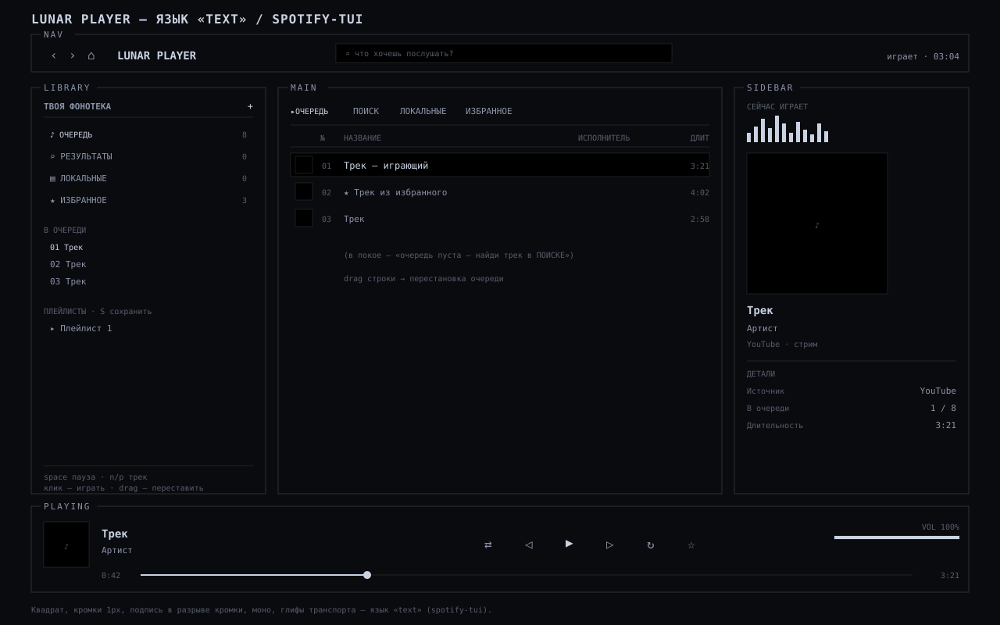

# PLAYER.md — язык Lunar Player

Как устроен и как выглядит плеер риса: сетка панелей, токены, состояния, ввод.
Это описание **языка плеера** — по нему правим `lunar_qt.py`, чтобы вид не рассыпался.

- Код: `.config/lunar/tui/lunar_qt.py` (UI, Qt/PySide6 + QPainter),
  `.config/lunar/tui/lunar_tui.py` (бэкенд: mpv JSON IPC, yt-dlp, локальные файлы).
- Запуск: `.config/hypr/scripts/lunar-tui` (хоткей `SUPER + M`), класс окна `lunar-tui`,
  правило — float + center (`hypr/hyprland.lua`).
- Окно: `1800 × 1060`, масштаб `SCALE 1.18`, единый фон `OPACITY 0.9`.
- Запасные версии: `lunar_gui.py` (GTK), `lunar_tui.py` (curses), `lunar_tui_app.py` (GTK+VTE).



---

## 1. Идея

**btop × Spotify.** Дашборд из панелей-«островов», у каждой — подпись в разрыве рамки
(`Nav / Library / Main / Sidebar / Playing`). Внутри — привычная трёхколоночная раскладка
(библиотека · список · «сейчас играет») и нижний транспорт.

Правила языка:
- **Флэт, без глянца.** Никаких градиентов-бликов; фон один на всё окно.
- **Монохром + один акцент.** Цвет — из палитры риса (`~/.cache/lunar/palette.json`),
  красный — только «опасное». Пресет `mono` (43PR) даёт чёрный фон и белый акцент.
- **Панель-рамка.** Скруглённый контур (`border_path`) с **разрывом сверху** под подпись —
  это и есть «остров». Подпись маленькая, приглушённая, над линией.
- **Настоящие обложки.** Локальные (`cover/folder/front/album.jpg|png`) и миниатюры YouTube;
  рисуются как `QPixmap` со скруглением и рамкой. Нет обложки — тёмная плашка с `♪`.
- **Живость по событию.** В покое CPU ~0: перерисовка только при игре/поиске/каве.

---

## 2. Схема сетки

```
 m=12, gap=10                                        W = ширина окна, H = высота
┌───────────────────────────────────────────────────────────────────────────────────────┐
│ Nav                                                              (высота 50)            │
│  ‹ › ⌂   LUNAR PLAYER      ⌕ что хочешь послушать?            играет · 03:04           │
├──────────────┬────────────────────────────────────────────────────┬───────────────────┤
│ Library      │ Main                                               │ Sidebar           │
│ (ширина 316) │ (тянется)                                          │ (ширина 356)      │
│              │                                                    │                   │
│ ТВОЯ ФОНОТЕКА│  ОЧЕРЕДЬ  ПОИСК  ЛОКАЛЬНЫЕ  ИЗБРАННОЕ               │ СЕЙЧАС ИГРАЕТ      │
│  ♪ ОЧЕРЕДЬ  n│  ─────────────────────────────────────────────     │  ▁▃▅▇▅▃▁ (cava)   │
│  ⌕ РЕЗУЛЬТ. n│   №   НАЗВАНИЕ        ИСПОЛНИТЕЛЬ        ДЛИТ       │  ┌─────────────┐  │
│  ▤ ЛОКАЛЬНЫЕn│   01  …               …                  3:21       │  │  обложка    │  │
│  ★ ИЗБРАННОЕn│   02  …               …                  4:02       │  │   (квадрат) │  │
│              │   03  …               …                  2:58       │  └─────────────┘  │
│ В ОЧЕРЕДИ    │                                                    │  Трек (акцент)    │
│  01 …        │   (в покое — подсказка «очередь пуста — найди     │  Артист           │
│  02 …        │    трек в ПОИСКЕ»)                                 │  YouTube · стрим  │
│ ПЛЕЙЛИСТЫ    │                                                    │  ─────────────    │
│  ▸ Плейлист 1│                                                    │  ДЕТАЛИ           │
│              │                                                    │   Источник …      │
│  space пауза │                                                    │   В очереди 2/8   │
│  ←/→ ±5с …   │                                                    │   Длительность …  │
├──────────────┴────────────────────────────────────────────────────┴───────────────────┤
│ Playing                                                              (высота 156)       │
│  ┌────┐  Трек                                     ⇤  ▶  ⇥   ⇄   ↻   ☆    VOL ██████ 100%│
│  │cov │  Артист                                                                          │
│  └────┘  0:42 ──────────────────●─────────────────────────────────────────────── 3:21   │
│  q выход · / поиск · space пауза · n/p трек · s шаффл · r повтор · f избранное           │
└───────────────────────────────────────────────────────────────────────────────────────┘
```

Читается сверху вниз: **шапка → три колонки → транспорт**. Пять панелей, каждая в своей рамке.

---

## 3. Панели

### Nav (шапка)
- `‹ › ⌂` — листать вкладки назад/вперёд, `⌂` — вернуться к очереди (сбрасывает поиск).
- `LUNAR PLAYER` — название, акцентом.
- Поиск `⌕ что хочешь послушать?` — клик ставит фокус, `/` с клавиатуры; Enter ищет в YouTube.
- Справа: статус (`играет / пауза / стоп`) и часы.

### Library (левая колонка)
- `ТВОЯ ФОНОТЕКА` и `+` (обновить локальные).
- Вкладки-коллекции со счётчиками: `ОЧЕРЕДЬ · РЕЗУЛЬТАТЫ · ЛОКАЛЬНЫЕ · ИЗБРАННОЕ`.
- `В ОЧЕРЕДИ` — очередь целиком; строки кликаются (играть).
- `ПЛЕЙЛИСТЫ · S сохранить` — сохранённые очереди, клик грузит.
- Внизу — подсказки по клавишам.

### Main (центральная колонка)
- Те же вкладки-пилюли, что в Library (общий `tab`).
- Таблица: `№ · НАЗВАНИЕ · ИСПОЛНИТЕЛЬ · ДЛИТ`, миниатюра обложки слева.
- Строки: hover-подсветка, играющая — акцентом и с `♪`, избранное — со `★`.
- Перетаскивание строк (вкладка `ОЧЕРЕДЬ`) — перестановка очереди.

### Sidebar (правая колонка)
- `СЕЙЧАС ИГРАЕТ` — cava-спектр (24 полосы) под заголовком.
- Крупная обложка, трек, артист, источник.
- `ДЕТАЛИ` — источник, место в очереди, длительность, состояние.

### Playing (нижняя полоса)
- Обложка, трек, артист.
- Транспорт: `⇤` пред · `▶/▮▮` играть/пауза · `⇥` след · `⇄` шаффл · `↻` повтор · `☆/★` избранное.
- `VOL` — полоса громкости, клик/драг.
- Seek: время `mm:ss` по краям, клик по шкале — перемотка.
- Строка-подсказка (или последнее сообщение статуса).

---

## 4. Токены

| Что | Значение |
|---|---|
| Сетка | `m 12`, `gap 10`, `Nav h 50`, `Library w 316`, `Sidebar w 356`, `Playing h 156` |
| Рамка панели | радиус `14`, толщина `1`, цвет `border`; разрыв под подпись |
| Отступы | `18` по краям панели, строки `24–36` |
| Шрифт | `Roboto Mono` (интерфейс), `JetBrainsMono Nerd Font` (иконки) |
| Кегли | подпись панели `10`, текст `11–12`, заголовок Playing `15`, крупный трек `14` |
| Цвет | `bg`, `bgCard`, `text/textDim/textFaint`, `accent`, `danger` — из палитры риса |
| Разделители | `SEP` = тонкая линия `text` @ ~0.10 |
| Hover | `ACC_HOVER` (фон) и `ACC_SOFT` (выбранное) |

Палитра читается из `~/.cache/lunar/palette.json` и перекрашивает окно на лету
(`QFileSystemWatcher`); пресет `mono` — чёрный фон, белый акцент.

---

## 5. Состояния

| Состояние | Как выглядит |
|---|---|
| Пусто | подсказка в списке; в Playing — «ничего не играет», обложка-заглушка `♪` |
| Играет | акцентный круг `▮▮`, cava живёт, прогресс тикает |
| Пауза | `▶` в круге, cava замирает (перерисовки нет) |
| Загрузка | статус «ищу…» / «играю…» в Nav и строке Playing |

---

## 6. Ввод

| Действие | Клавиша / мышь |
|---|---|
| Выход | `q` или `Esc` |
| Поиск | `/`, Enter — искать, Esc — выйти из ввода (пробел вводится) |
| Навигация | `↑/↓`, `Tab` — вкладки; клик по строке — играть |
| Транспорт | `space` пауза, `n`/`p` трек, `←/→` ±5с |
| Режимы | `s` шаффл, `r` повтор (выкл/все/один) |
| Коллекции | `f` избранное, `S` сохранить очередь как плейлист, `a` в очередь |
| Мышь | клик по кнопкам/шкалам/вкладкам, drag строки — переставить |

---

## 7. Что закрыто и что нет

- **Есть:** панели-рамки, настоящие обложки, cava, hover, перестановка очереди,
  повтор, избранное, плейлисты, память состояния (`player-state.json` / `player-fav.json`).
- **Нет:** «смотреть в mpv» (видео), drag-громкость мышью, умная сортировка локальных,
  отмена поиска, теги/длительность локальных (сейчас «0:00»).

Правим язык — сверяемся с этим файлом и `DESIGN.md` (общий язык риса).
