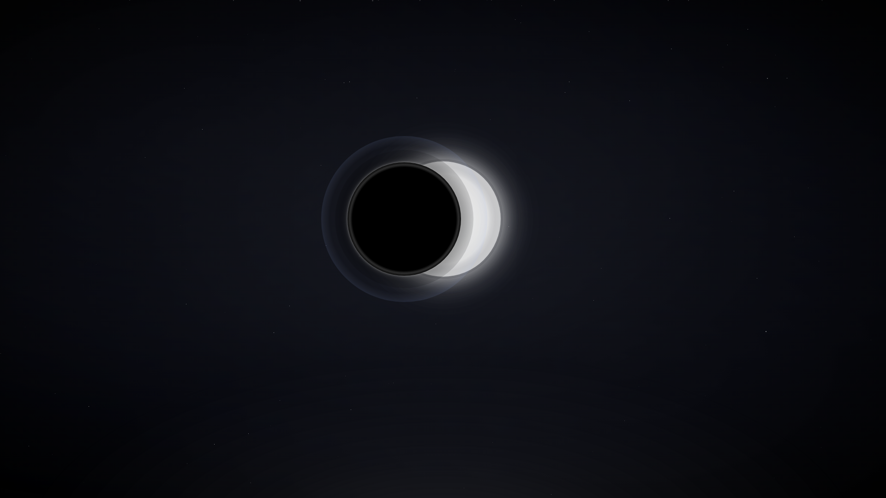
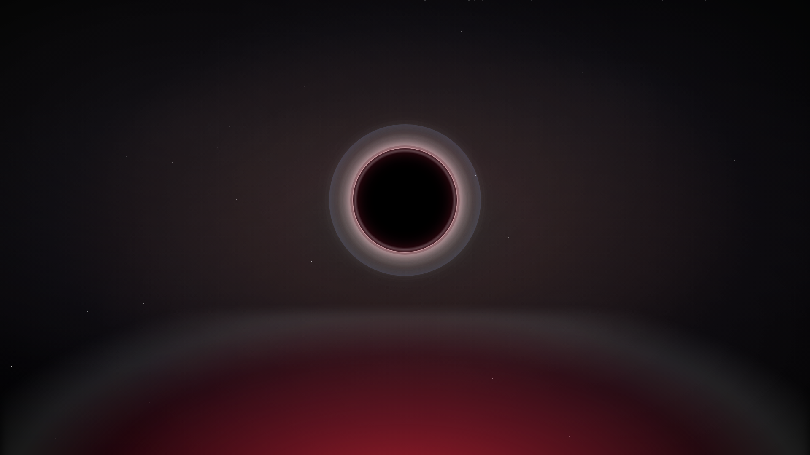

# Lunar Eclipse · Hyprland rice

Тёмный райс про луну. Восемь рабочих столов, восемь фаз затмения:
обои меняются вместе с ними, waybar в центре показывает «покрытие» фазы.
Обои **живые** — звёзды мерцают, гало Солнца дышит, на полном затмении
идут метеоры. Сделано с нуля под Hyprland (Lua-конфиг), в репе лежит
и веб-превью в папке `sait/`, оттуда же и тащились цвета (и анимации).

Текущая версия — `0.1.2`, история изменений в [`CHANGELOG.md`](CHANGELOG.md).

## Как выглядит





Остальные фазы в `wallpapers/`, полное превью в `sait/`.

## Что внутри

- `hypr/hyprland.lua` сам конфиг. Собирался под Hyprland 0.56, Lua API.
- `hypr/scripts/` скрипты: `eclipse-walls.sh` (обои по фазам, опрашивает
  активный стол через `hyprctl activeworkspace`; socket2-events в Hyprland
  0.56 сломаны, поэтому socat не нужен) и `eclipse-pbar.sh` (прогресс-бар
  для waybar).
- `hypr/scripts/eclipse-anim-gen.py` — генератор живых обоев: портирует
  `exportPhaseSVG()` из `sait/script.js` (та же сцена, что отдаёт кнопка
  «Скачать обои» на сайте), добавляет мерцание звёзд, дыхание гало, дрейф
  пыли, пульс короны и метеоры, и собирает `eclipse_01..08.gif`.
- `hypr/scripts/eclipse-live-gen.py` — то же, но кадры снимаются прямо с
  ЖИВОЙ CSS-сцены сайта через headless Chromium: вид 1-в-1 с превью (радиус
  солнца 125, на фазе 4 — чёрная луна с тонким кольцом), 12 с петля, 60 fps.
  Нужен `chromium`.
- `hypr/scripts/eclipse-network.sh` — Wi-Fi меню для waybar (wofi + `nmcli`):
  список сетей, подключение с запросом пароля, отключение, вкл/выкл радио,
  «Настройки сети…». Пароль спрашивает `eclipse-askpass.py`.
- `hypr/scripts/eclipse-calendar.py` — календарь-попап в стиле райса
  (клик по часам): навигация стрелками/PgUp-PgDn, клик по дню копирует дату.
- `hypr/scripts/eclipse-cheatsheet.py` — оверлей горячих клавиш (`SUPER` + `/`).
- `fastfetch/` — конфиг fastfetch + логотип-полузатмение `eclipse.png`
  (рендерится из `eclipse.svg`), показывается при старте kitty.
- `shell/lunar.bash` — приветствие fastfetch, удобные алиасы, PS1 в палитре;
  подключается из `~/.bashrc` (это делает `install.sh`).
- `kde/` — тема Dolphin/KDE `Lunar Eclipse` (`kdeglobals`, `dolphinrc`,
  `color-schemes/LunarEclipse.colors`).
- `waybar/`, `wofi/`, `kitty/`, `mako/`, `hyprlock/`, `hypridle/` остальная обвязка.
- `wallpapers/` 8 статичных картинок, фазы луны (fallback, если GIF нет).

Цвета: чёрный фон, поверхности `rgba(10,10,10,.72)`, акцент `#7ea6ff`.
В общем, всё крутится вокруг лунного света. Скругления 14px, лёгкий blur,
рамка активного окна — спокойный однотонный лунный свет.

## На что обратить внимание

С Hyprland 0.55 hyprlang упразднили, конфиг теперь только `.lua`.
То есть `~/.config/hypr/hyprland.conf` он **не читает**, весь смысл
в `hyprland.lua`. Долго ловил это сам: ставишь значения в `.conf`,
а Hyprland их молча игнорирует и живёт на дефолтах.

Ещё пара граблей, с которыми уже разобрался в конфигах:

- hypridle с версии 0.1.8 ищет конфиг в `~/.config/hypr/`, а не в
  `~/.config/hypridle/`. И опции у него в listener пишутся через дефис
  (`on-timeout`, а не `on_timeout`). На старых названиях он просто молча
  не выполняет команды.
- Демон обоев это `awww`, не `swww`. swww тут ни при чём.

## Установка

Если Arch чистый, с нуля:

```bash
git clone https://github.com/AlanMillerSora/lunar-hyprland.git ~/rice
cd ~/rice
./setup.sh
sudo reboot
```

`setup.sh` сам ставит пакеты, драйверы GPU (определяет по lspci), кидает
конфиги и добавляет автозапуск Hyprland на tty1. Хочешь автовход без
пароля и русскую локаль, используй `./setup.sh --autologin --ru`. Запускать
один раз, при повторном запуске флаги не нужны.

Если Hyprland уже стоит, просто:

```bash
cd ~/rice
./install.sh
hyprctl configerrors   # должно быть пусто
hyprctl reload
```

`install.sh` раскладывает всё по `~/.config/`, обои в
`~/Pictures/EclipseWalls/`, `eclipse-walls.sh` в `~/.local/bin/`.
Заодно он генерирует живые обои (`eclipse_01..08.gif`); если не хочется —
`ECLIPSE_ANIM=0 ./install.sh`. Для видео добавь `ECLIPSE_VIDEO=1`, а для
вида 1-в-1 с сайтом (съёмка CSS, нужен `chromium`) — ещё и `ECLIPSE_LIVE=1`.

Нужны пакеты: `hyprland waybar wofi kitty mako awww hyprlock hypridle fastfetch`
плюс `grim slurp wl-clipboard wireplumber python` и шрифты
`ttf-jetbrains-mono ttf-inter`. Для живых обоев ещё `librsvg` (rsvg-convert)
и `ffmpeg`.

## Живые обои

`eclipse-walls.sh` при переключении стола ставит обои фазы (стол = фаза
затмения). Режим выбирается сам:

* **mpvpaper + видео** (`eclipse_NN.webm`) — если установлен `mpvpaper`.
  Полный цвет, 60 fps, без зерна и полос. Один процесс на все мониторы,
  фаза переключается через IPC (`loadfile`), без чёрных вспышек.
* **awww + GIF** (`eclipse_NN.gif`, иначе `eclipse_NN.png`) — запасной
  вариант. `awww` играет только GIF (animated WebP/APNG показывает
  статикой), память держит ~30 МБ.

Установить видео-режим (один раз, нужен sudo) и перезапустить службу:

```bash
yay -S mpvpaper      # mpvpaper подтянет mpv сам
```

Перегенерировать/подкрутить:

```bash
~/.local/bin/eclipse-anim-gen.py                              # GIF, 6с, 25fps (awww)
~/.local/bin/eclipse-anim-gen.py --fps 60 --no-gif --video    # видео, 6с, 60fps (SVG-порт)
~/.local/bin/eclipse-anim-gen.py --phases 4 --no-gif --video  # только полное затмение
~/.local/bin/eclipse-anim-gen.py --duration 8 --fps 25
~/.local/bin/eclipse-anim-gen.py --dither none                # GIF без дизера (но полосы)

~/.local/bin/eclipse-live-gen.py                              # видео 1-в-1 с сайтом, 12с, 60fps
~/.local/bin/eclipse-live-gen.py --phases 4 --fps 30          # быстрее, только полное затмение
~/.local/bin/eclipse-live-gen.py --sait ~/rice/sait           # если sait/ не рядом со скриптом
```

`eclipse-anim-gen.py` рисует сцену сам (SVG → GIF/видео) и хватает `librsvg`
с `ffmpeg`. `eclipse-live-gen.py` снимает кадры с живой страницы сайта через
`chromium` (CDP, по браузеру на фазу) — картинка совпадает с превью один в
один, включая чёрную луну с тонким кольцом на 4-м столе.

Видео — VP9 10-бит (`yuv420p10le`), CRF 18: градиенты без полос; флаг
`--video-codec h264` даст `.mp4` (легче декодируется железом).

Для GIF `fps` бери 20, 25 или 50: GIF хранит задержку кадра в сотых
секунды, и на 30fps она становится неравномерной (3/3/4) — лёгкий рывок.
Для видео ограничений нет: 60 fps = ровно под 60 Гц монитора.

Анимация зациклена бесшовно: все периоды (дыхание Солнца, дрейф пыли,
метеоры, мерцание) укладываются в длину петли. Палитра GIF считается по
всем кадрам (`stats_mode=full`) — иначе на тёмных градиентах вылезают полосы.
В режиме 1-в-1 то же самое делается для CSS-анимаций: их длительности
квантуются на делители длины петли, иначе шов «прыгает».

### Про качество

Источник гладкий в обоих случаях: SVG-рендер даёт переходы по 1 единице luma,
а живая CSS-сцена снимается как есть (браузерный дизер как раз спасает
градиенты от полос). Полосы в GIF брались из скудной палитры —
лечится `--palette-stat full` (уже дефолт). Но GIF всё равно держит максимум
256 цветов, поэтому широкие гало и пыль квантуются с дизером — вблизи видно
зерно; это потолок `awww`. Видео-путь через `mpvpaper` этого потолка не
имеет: VP9 10-бит воспроизводит исходные градиенты практически один в один.

## Клавиши

| Хоткей | Что делает |
|---|---|
| `SUPER` + `RETURN` | терминал (kitty) |
| `SUPER` + `D` / `A` | меню (wofi: drun / run) |
| `SUPER` + `E` | файловый менеджер (Dolphin) |
| `SUPER` + `/` | оверлей горячих клавиш |
| `SUPER` + `1..8` | перейти на фазу |
| `SUPER` + `SHIFT` + `1..8` | утащить окно на фазу |
| `SUPER` + `Q` | закрыть окно |
| `SUPER` + `W` | максимизировать |
| `SUPER` + `SHIFT` + `W` | фуллскрин |
| `SUPER` + `F` / `P` | float / псевдотайлинг |
| `SUPER` + `S` | скретчпад |
| `SUPER` + `SHIFT` + `L` | блокировка (hyprlock) |
| `PRINT` | скриншот области |
| `SUPER` + `R` | перечитать конфиг |

## Подстройка под себя

- Монитор: раскомментируй `hl.monitor({...})` в `hypr/hyprland.lua`
  и пропиши свой.
- Раскладка: по умолчанию `us,ru`, переключение Alt+Shift
  (`grp:lalt_lshift_toggle`). Привычнее `Ctrl+Shift`, поменяй в input.
- Задержки блокировки: `hypridle/hypridle.conf` (10 мин до лока,
  15 мин до гашения экрана).
- Долго ли, коротко ли, но scrollback у kitty 10000 строк и прозрачность
  0.94, сквозь неё видно blur. Если не нужен полупрозрачный фон, убери
  `background_opacity` в `kitty/kitty.conf`.

## Если что-то не так

```bash
hyprctl configerrors           # ошибки конфига
hyprctl activeworkspace -j     # какой стол активен
awww query                     # что сейчас на фоне
journalctl --user -u hyprland -f
```

Известный косяк: если на машине уже живёт другой демон уведомлений
(dunst и т.п.), mako не стартует (`Failed to acquire service name`).
Выключи чужой сервис (`systemctl --user disable --now dunst.service`).

Всё раскладывается в `~/.config/` обычными копиями, без симлинков и
стеллажей, удобно править руками, не задумываясь.