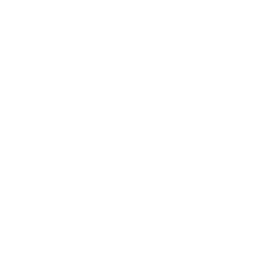
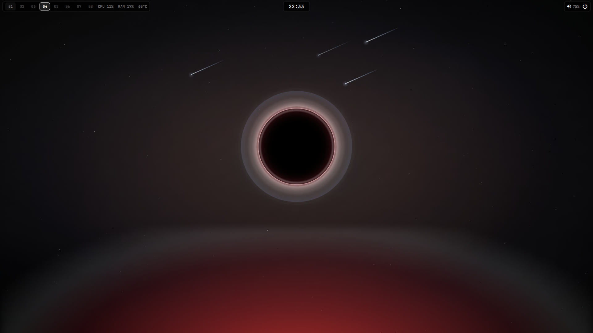
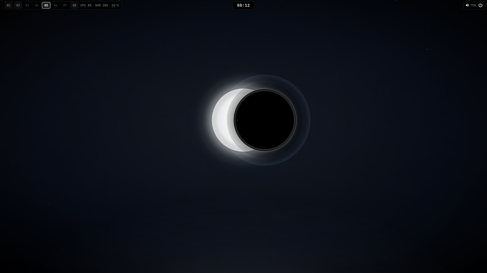
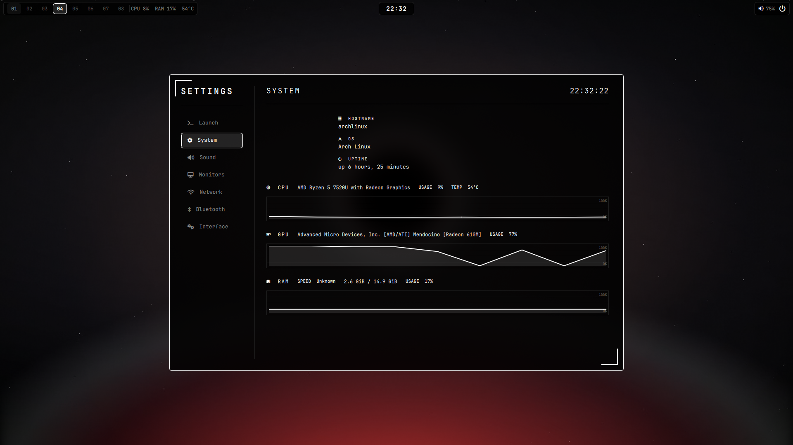
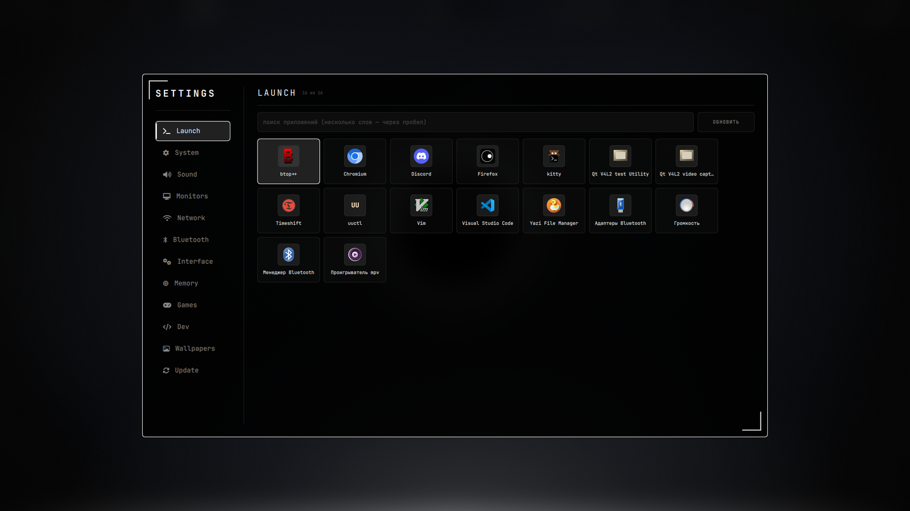
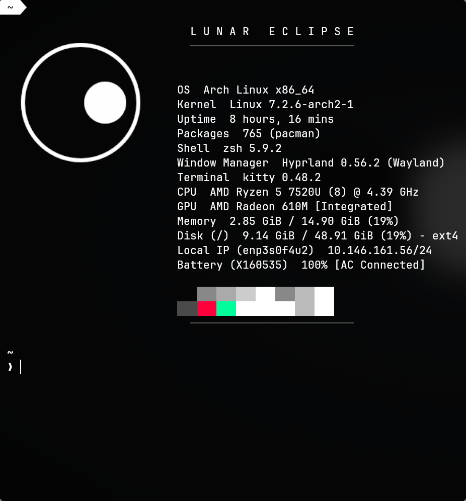
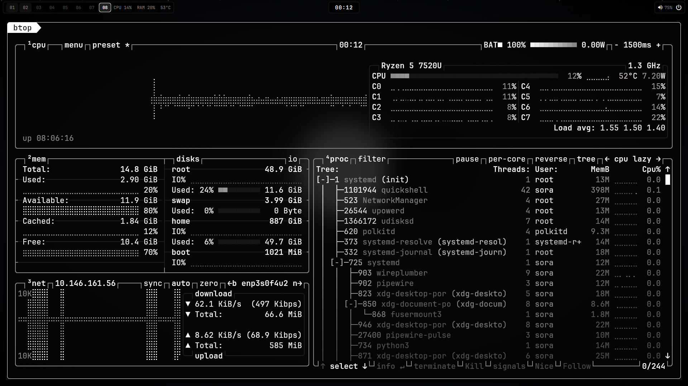
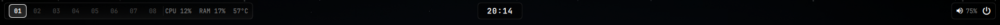

<div align="center">



# Lunar Eclipse

**Hyprland rice · монохромный HUD · весь шелл на Quickshell**

Тонкие рамки, острые уголки, чёрно-белая палитра и ни одной лишней детали.


</div>

---

## ✨ Что это

Полностью кастомная оболочка для Hyprland: верхняя панель, лаунчер и
настройки, боковая панель, OSD — всё написано на **Quickshell (QML)**, без
waybar и GTK-приложений.

Один визуальный язык на всю систему: **рамка 1px, радиус 6, острые
HUD-скобки**, монохромная палитра, шрифт JetBrains Mono.

## 📸 Скриншоты

**Рабочий стол — фазы затмения**

<div align="center">
  
  <br/><sub>Стол 04 — полное затмение</sub>
</div>

<div align="center">
  
  <br/><sub>Стол 05 — частное затмение</sub>
</div>

**Hub — настройки и лаунчер**

| System — графики CPU / GPU / RAM | Launch — лаунчер приложений |
|:---:|:---:|
|  |  |
| Живые графики загрузки и температуры | Поиск и сетка приложений |

**Терминал и монитор**

| Терминал (zsh + starship) | btop — тема `lunar` |
|:---:|:---:|
|  |  |
| Логотип-затмение + инфо системы | Автозапуск на столе 09 |

<div align="center">
  
  <br/><sub>Верхняя панель — столы 01–09, CPU/RAM/°C, часы, трек, звук, питание</sub>
</div>

## 🧩 Компоненты

| Компонент | Файл | Что делает |
|---|---|---|
| **Панель** | `quickshell/LunarPanel.qml` | 42px сверху. Слева — лого+фаза и столы `01–09`; справа — сеть (в т.ч. **скорость МБ/с**)/раскладка/уведомления, блок действий (Game Mode, профиль питания, запись), CPU/RAM/°C/GPU, mpris, трей, громкость |
| **Media** | `quickshell/LunarMedia.qml` | Попап «сейчас играет» (клик по треку на панели): трек/исполнитель, прогресс, назад/пауза/вперёд |
| **Статус** | `hypr/scripts/eclipse-status.sh` | Одна строка статуса для панели: сеть, раскладка, DND, уведомления, GPU, Game Mode, профиль питания, запись |
| **Game Mode** | `hypr/scripts/eclipse-gamemode.sh` | Игровой режим: анимации/blur выкл, DND, пауза hypridle, performance, tearing |
| **Запись** | `hypr/scripts/eclipse-record.sh` | Запись экрана (wf-recorder) → `~/Videos/lunar-*.mp4`; аппаратный кодек (VAAPI: NVENC на NVIDIA, родной на AMD/Intel) с авто-откатом на софт (libx264) |
| **Меню питания** | `quickshell/LunarPower.qml` | Меню питания в стиле системы (HUD-скобки, рамка 1px): спящий/гибернация/выход/перезагрузка/выключение, `SUPER + ESC` |
| **Games** | `quickshell/SettingsPages/GamesPage.qml` | Список игр (desktop-записи с `Categories=Game`) и запуск |
| **Dev** | `quickshell/SettingsPages/DevPage.qml` | Раздел «Разработка»: сам находит git-проекты и показывает ветку/изменения/последний коммит; кнопки VS Code, терминал и GIT-панель (ветки, коммит, `diff`, `pull`, `push`) |
| **Обновления** | `quickshell/SettingsPages/SystemPage.qml` | Раздел «Обновления» в System: проверка через `checkupdates`/`pacman -Qu`, запуск `sudo pacman -Syu` в терминале |
| **VS Code** | `.config/Code/User/settings.json` | VS Code в терминальном виде: монохром, JetBrains Mono, без minimap и иконок, прямые углы |
| **Monitors** | `quickshell/SettingsPages/MonitorsPage.qml` | Режим мониторов, яркость (ноут — `brightnessctl`, внешние — `ddcutil`), ночной свет, частота обновления (Гц), VRR (FreeSync/GSync), масштаб, tearing |
| **Яркость** | `hypr/scripts/eclipse-brightness.sh` | Яркость для Monitors: встроенная панель через `brightnessctl`, внешние мониторы через `ddcutil` (DDC/CI) |
| **Hub** | `quickshell/LunarHub.qml` | Лаунчер + настройки (980×640, как у 43PR): Launch, System, Sound, Monitors, Network, Bluetooth, Interface, Memory, Games |
| **Memory** | `quickshell/SettingsPages/MemoryPage.qml` | Индикатор заполнения RAM/SWAP и общей памяти (MEM) + очистка системы (кнопка «ОЧИСТИТЬ») |
| **Очистка** | `hypr/scripts/eclipse-cleanup.sh` | Сироты, кэш пакетов, журнал, tmpfiles, кэш yay, эскизы; опционально браузеры |
| **Файлы** | `yazi/theme.toml`, `yazi/yazi.toml` | Файловый менеджер yazi в монохроме системы (`SUPER + E`); Enter по исходнику открывает его в VS Code |
| **Firefox** | `firefox/chrome/userChrome.css`, `firefox/user.js` | Тёмный монохром, вертикальные вкладки, без рекламы и телеметрии; своя страница новой вкладки `lunar/firefox-home.html` (отдаёт локальный сервис `lunar-homepage`) и иконка Lunar |
| **Sidebar** | `quickshell/LunarSidebar.qml` | Выдвигается от левого края (560px): чат (**OpenCode** — агент прямо в панели), буфер (cliphist; ПКМ — удалить), заметки |
| **Sidebar R** | `quickshell/LunarSidebarRight.qml` | Выдвигается от правого края: уведомления (mako), «сейчас играет» (mpris), календарь (прокручивается, 18 месяцев), запись экрана со списком |
| **Буфер** | `quickshell/LunarClipboard.qml` | История cliphist с поиском: `SUPER + V` |
| **Громкость** | `quickshell/LunarVolume.qml` | Попап с крупным ползунком (клик по значку громкости на панели) |
| **Трей** | `quickshell/LunarTray.qml` | Системный трей (SNI): в панели видно `Theme.trayVisible` (3) значка, остальные сворачиваются в список «+N» — ЛКМ активирует, ПКМ открывает меню приложения |
| **OSD** | `quickshell/LunarVolumeOsd.qml`, `LunarBrightnessOsd.qml` | Индикаторы громкости и яркости с HUD-скобками |
| **Ползунок** | `quickshell/Slider.qml` | Общий слайдер темы (настройки, попап громкости) |
| **Тема** | `quickshell/Theme.qml` | Единая палитра, радиусы, шрифты; прозрачность интерфейса, масштаб шрифта и число значков трея сохраняются между перезапусками Quickshell (`lunar-ui.json` в state-каталоге) |
| **btop** | `btop/themes/lunar.theme` | Монитор системы в теме `lunar`, автозапуск на столе 09 |

## 🗂 Рабочие столы

Столы разведены по задачам, окна раскладываются сами (правила — `app_ws` в `hyprland.lua`):

| Стол | Для чего |
|---|---|
| **01** | игры (Steam/Proton, Heroic, Lutris, эмуляторы) |
| **02** | браузер — Firefox (он же браузер по умолчанию) |
| **03** | Discord |
| **04** | Steam |
| **05** | затмение — пустой (не для окон) |
| **06** | кодинг (VS Code, Zed, JetBrains…) |
| **07** | пустой |
| **08** | пустой |
| **09** | btop (открывается автоматически) |

Иконки в панели — зеркальный ряд фаз: `01` и `09` полная луна, `02–04` серпы
со светом справа, `05` кольцо-затмение, `06–08` серпы со светом слева.

Остальные приложения открываются на текущем столе. Дополнить список классов —
в таблице `app_ws` в `hyprland.lua`.

## 🌘 Обои

Живые обои сменяются по столам (`hypr/scripts/eclipse-walls.sh`): видео `eclipse_NN.webm`
через **mpvpaper**, статика `eclipse_NN.png` — через **awww** (если видео нет).

Кадры снимает превью-сайт (`sait/`) — генератор рендерит сцену в любом разрешении
(headless Chromium), поэтому на 1920×1080 ноута и 3440×1440 ПК обои свои:

```
hypr/scripts/eclipse-walls-gen.sh                # кадры под текущий монитор
hypr/scripts/eclipse-walls-gen.sh 3440x1440      # явное разрешение
FORMAT=video hypr/scripts/eclipse-walls-gen.sh   # ещё и живые webm (12 с, 60 fps)
hypr/scripts/eclipse-walls.sh set ~/.local/share/lunar/walls/3440x1440   # применить
```

Всё то же есть в Hub → **Wallpapers** (выбор разрешения, генерация, применение).

## 📂 Структура

```
.
├── .config/                # → ~/.config
│   ├── hypr/               # hyprland.lua, scripts/
│   ├── quickshell/         # весь шелл (QML) + assets/moon-phases
│   ├── Code/               # VS Code: тема в стиле терминала (settings.json)
│   ├── kitty/              # терминал
│   ├── fastfetch/          # логотип + конфиг
│   ├── btop/               # системный монитор (тема lunar)
│   ├── gtk-3.0/ gtk-4.0/   # GTK-тема
│   ├── kdeglobals          # KDE: цвета и курсор
│   ├── yazi/               # файловый менеджер (тема lunar, opener VS Code)
│   ├── firefox/            # тема и префы Firefox (userChrome/userContent, user.js)
│   ├── mako/               # уведомления
│   ├── hypridle/           # idle
│   ├── lunar/lunar.bash    # bash
│   ├── .zshrc              # zsh
│   └── starship.toml       # промпт
├── wallpapers/             # 9 фаз затмения (01..09)
├── sait/                   # превью-сайт → генератор обоев под любое разрешение
├── color-schemes/          # цветовая схема KDE → ~/.local/share/color-schemes
├── systemd/                # wifi-guard, lunar-homepage (страница новой вкладки)
├── assets/                 # логотип и скриншоты
├── install.sh              # установка конфигов
└── get-deps.sh             # зависимости
```

## 🚀 Установка

```bash
git clone https://github.com/AlanMillerSora/lunar-hyprland.git ~/rice
cd ~/rice

./get-deps.sh     # зависимости (pacman; сам включает multilib для steam)
./install.sh      # конфиги → ~/.config, обои, zsh по умолчанию
```

Затем перелогинься в Hyprland (или `hyprctl reload`).

> `install.sh` можно запускать повторно: если в `~/.config` есть локальные
> правки, он предупредит и сложит их в `~/.config-backup-<дата>/` перед
> тем, как перезаписать конфигами из репо.

> Требуется **Hyprland 0.55+** (конфиг на Lua — `hyprland.lua`).

## 🛡️ Обход DPI (zapret)

Чтобы открывались **Discord** и **YouTube**, рис ставит оригинальный
[zapret](https://github.com/bol-van/zapret) из исходников в `/opt/zapret`
и поднимает `zapret.service`. Ставится автоматически из `./install.sh`
(зависимости — в `./get-deps.sh`). Flowseal-репозиторий Windows-only,
поэтому используется апстрим bol-van с портированной стратегией.

Управление — **Hub → Network → блок ZAPRET** (включить/выключить,
обновить, подобрать стратегию) или из терминала:

```bash
~/.config/hypr/scripts/eclipse-zapret.sh status    # состояние
~/.config/hypr/scripts/eclipse-zapret.sh toggle    # вкл/выкл (+ автозапуск)
~/.config/hypr/scripts/eclipse-zapret.sh update    # обновить и пересобрать
~/.config/hypr/scripts/eclipse-zapret.sh tune      # подобрать стратегию (blockcheck)
```

**Обновления.** `/opt/zapret` — обычный git-клон апстрима. `update`
делает `git pull` → `make systemd` → `systemctl restart zapret`.
`config` и `ipset/` лежат в `.gitignore`, поэтому правки не теряются.
Если провайдер сменил DPI и обход «отвалился» — запусти `tune`
(`blockcheck.sh` найдёт новую рабочую стратегию), её параметры
`--dpi-desync=…` впиши в `NFQWS_OPT` в `/opt/zapret/config`.

> Для переключателя в Hub установщик добавляет узкое NOPASSWD-правило
> `/etc/sudoers.d/lunar-zapret` (только `systemctl start/stop/restart/enable/disable`
> для `zapret.service`). Обновление и подбор идут в терминале.

## 🧩 Vencord (мод Discord)

В официальный клиент Discord вшит [Vencord](https://vencord.dev)
(плагины, темы). Патчится `app.asar`, а Discord при обновлении создаёт новый
каталог `app-<версия>` — патч слетает, поэтому после обновления Discord
жми **ПЕРЕПАТЧИТЬ** в Hub → Network (блок VENCORD) или:

```bash
~/.config/hypr/scripts/eclipse-vencord.sh status    # состояние
~/.config/hypr/scripts/eclipse-vencord.sh patch     # закрыть Discord, пропатчить, запустить
~/.config/hypr/scripts/eclipse-vencord.sh update    # обновить инсталлятор (AUR) и пропатчить
```

Инсталлятор — из AUR (`vencord-installer-bin`, ставится `./get-deps.sh`).
Настройки Vencord — в клиенте: **User Settings → Vencord**.

## 🟩 NVIDIA

Рис рассчитан и на NVIDIA: переменные NVIDIA включаются только если карта
реально найдена (проверка по sysfs), поэтому один и тот же конфиг работает и
на NVIDIA-десктопе, и на AMD/Intel-ноуте.

**Драйвер.** В Arch (ветка 615) проприетарного модуля ядра `nvidia`/`nvidia-dkms`
больше нет — NVIDIA свернула его. Официальная замена — **`nvidia-open-dkms`**
(открытые модули ядра от самой NVIDIA, это не nouveau), а user-space
(`nvidia-utils`) остаётся проприетарным. `get-deps.sh` ставит его сам, если
видит карту NVIDIA:

```
nvidia-open-dkms  <ядро>-headers  nvidia-utils  nvidia-settings  libva-nvidia-driver  libva-utils
```

`libva-nvidia-driver` — VAAPI-прослойка поверх NVENC: именно через неё
работает аппаратная запись экрана (см. `eclipse-record.sh`).
`libva-utils` даёт `vainfo` — проверить, что энкодер виден:

```bash
vainfo | grep -i Encoder      # должны быть H264/HEVC Encoder
```

- Turing и новее (GTX 16xx / RTX 20xx+) — `nvidia-open-dkms`, поддерживается.
- Pascal (GTX 10xx) и старше — только legacy `nvidia-580xx-dkms` из AUR.

**KMS (нужен для Wayland).** С nvidia-utils 560.35.03 DRM-режим включён по
умолчанию. Проверка:

```bash
cat /sys/module/nvidia_drm/parameters/modeset   # ожидаем Y
cat /sys/module/nvidia_drm/parameters/fbdev     # Y — свой framebuffer
```

Если `N` — добавь kernel-параметр `nvidia_drm.modeset=1`; для раннего KMS
пропиши в `/etc/mkinitcpio.conf`:

```
MODULES=(nvidia nvidia_modeset nvidia_uvm nvidia_drm)
```

и пересобери initramfs (`sudo mkinitcpio -P`). Нужен драйвер **555+**, иначе
Wayland мерцает (нет explicit sync).

**Что уже учтено:**

- Hyprland сам выставляет `LIBVA_DRIVER_NAME=nvidia`, а если монитор подключён
  к NVIDIA — ещё `__GLX_VENDOR_LIBRARY_NAME`, `GBM_BACKEND=nvidia-drm`,
  `NVD_BACKEND=direct` (`hyprland.lua`);
- панель и Hub → System показывают загрузку/температуру GPU через `nvidia-smi`;
- VRR/G-Sync: `misc.vrr = 2` в `hyprland.lua`;
- ночной свет — `gammastep` (через `wlr-gamma-control`).

**Гибридная графика** (дискретная NVIDIA + встроенная AMD/Intel) автоматически
не настраивается: если вывод идёт через iGPU, переменные NVIDIA не включаются.
Для принудительного вывода через NVIDIA задай `AQ_DRM_DEVICES` (см. Hyprland
Wiki → Nvidia).

**Яркость.** Встроенная панель — `brightnessctl`, внешние мониторы — `ddcutil`
(DDC/CI). Для ddcutil нужен `i2c-dev` — `./install.sh` включает модуль и
добавляет пользователя в группу `i2c` автоматически (нужен перелогин).
Вручную то же самое:

```bash
echo i2c-dev | sudo tee /etc/modules-load.d/i2c-dev.conf
sudo usermod -aG i2c "$USER"     # затем перелогиниться
```

## 🧑💻 Разработка

- **Hub → Dev** — дашборд проектов: сам находит git-репозитории в `~/Projects`,
  `~/projects`, `~/dev`, `~/code`, `~/src`, `~/work`, `~/rice`, `~/git` и в
  домашнем каталоге. Показывает ветку, число изменений и последний коммит.
  Кнопки: **CODE** (открыть в VS Code), **TERM** (терминал в проекте),
  **GIT** — панель с ветками, коммитом, `diff`, `pull`, `push` и выводом git;
  клик по строке — открыть проект в VS Code.
- **VS Code** ставится из AUR (`visual-studio-code-bin`, официальный билд
  Microsoft) и оформлен в терминальном стиле: монохром, JetBrains Mono,
  без minimap, иконок файлов и цветных скобок, прямые углы (правило в
  `hyprland.lua`). Настройки — `.config/Code/User/settings.json`.

## 🤖 Чат (OpenCode)

В левом сайдбаре — вкладка **чат**: это полноценный агент [OpenCode](https://opencode.ai)
прямо в панели. Вывод стримится в UI (`opencode run --format json`), контекст
держится в сессии (`--continue`), «＋» начинает новую, «▣» открывает обычный
OpenCode в терминале.

**Права.** Агент умеет выполнять команды с `sudo`, но только доверенные —
белый список в `/etc/sudoers.d/lunar-agent` (ставит `./install.sh`):
`journalctl`, `systemctl` (start/stop/restart/enable/disable, включая `--user`),
`pacman -Syu/-Sy/-Qu/-Qe` и скрипты риса (`~/rice`, `~/.config/hypr/scripts`).
Всё остальное от root — только после подтверждения в чате.

## 🔄 Обновления- **Hub → Update** — вкладка обновления: состояние (буфер, число пакетов),
  кнопки **ОБНОВИТЬ** (с буфером), **ОБНОВИТЬ СРАЗУ**, **ОТКАТ** (снимки
  timeshift) и **ПРОВЕРИТЬ**; свежие новости Arch показываются с переводом
  на русский (Google Translate).
- Скрипты: `eclipse-update.sh` — буфер 1–2 дня, `informant`, перевод
  новостей, бэкап, `pacman -Syu` (+ AUR через paru/yay);
  `eclipse-backup.sh` — бэкап конфигов перед обновлением с ротацией
  (по умолчанию 5 последних), каталог `~/.local/share/lunar/backups/`.
- **timeshift** — снимки системы перед обновлением (ext4, rsync). Откат —
  кнопкой «Откат» во вкладке (сначала предпросмотр снимков).

## 🆘 Если Quickshell отвалился

Панель/Hub/OSD живут под systemd-user с авто-рестартом. Поднять шелл:

```bash
systemctl --user restart lunar-quickshell.service   # перезапуск
systemctl --user status  lunar-quickshell.service   # что случилось
```

Не помогло — запусти вручную (в терминале):

```bash
quickshell
```

Откат: **конфиги** — через git (`git -C ~/rice checkout -- .config`),
**система** — снимком timeshift (Hub → Update → **ОТКАТ**).

## ⌨️ Горячие клавиши

| Клавиши | Действие |
|---|---|
| `SUPER + RETURN` | Терминал (kitty) |
| `SUPER + G` | Hub: лаунчер + настройки |
| `SUPER + E` | Файлы (yazi) |
| `SUPER + V` | Буфер обмена (cliphist) |
| `SUPER + SHIFT + E` | Боковая панель (слева) |
| `SUPER + SHIFT + N` | Панель справа (уведомления/музыка/календарь) |
| `SUPER + SHIFT + R` | Запись экрана (вкл/выкл) |
| `SUPER + SHIFT + G` | Game Mode (вкл/выкл) |
| `SUPER + SHIFT + D` | Hub: раздел «Разработка» |
| `SUPER + /` | Шпаргалка по хоткеям |
| `SUPER + Q` | Закрыть окно |
| `SUPER + W` / `SHIFT+W` | Развернуть / полный экран |
| `SUPER + F` / `P` / `SPACE` | Плавающее / псевдо / следующее |
| `SUPER + SHIFT + P` | Закрепить окно поверх |
| `SUPER + TAB` / `SHIFT+TAB` | Следующее / предыдущее окно |
| `SUPER + ←↑↓→` / `HJKL` | Фокус |
| `SUPER + SHIFT + ←↑↓→` | Перенос окна |
| `SUPER + 1…9` | Рабочий стол (фаза затмения) |
| `SUPER + SHIFT + 1…9` | Перенести окно на стол |
| `SUPER + T` / `SHIFT+T` | Группа / закрепить |
| `SUPER + S` / `SHIFT+S` | Scratchpad |
| `SUPER + ESC` | Меню питания (Quickshell) |
| `PRINT` / `SUPER + PRINT` | Скриншот: область / весь экран (в буфер) |
| `SUPER + SHIFT + PRINT` | Скриншот всего экрана в файл (`~/Pictures/Screenshots`) |
| `XF86MonBrightness ±` | Яркость (ноут — backlight, внешние — DDC/CI) + OSD |
| `SUPER + R` | Перезагрузить Hyprland |

## 🎨 Тема

Всё крутится в **Hub → Interface**:

- **Прозрачность интерфейса** — влияет на фон Hub, Sidebar, OSD и панели;
- **Размытие (блюр)** — управляет blur всей системы (Hyprland): 0% — выключен;
- **Размер шрифта** — масштабирует весь текст шелла.
- **Курсор** — Bibata-Modern-Ice (монохромный, с обводкой); ставится в `install.sh`.

Палитра: фон `#050505`, текст `#ffffff`, приглушённый `#888888`, акценты
белые, опасность `#ff003c`.

## 📄 Лицензия

[MIT](LICENSE)
