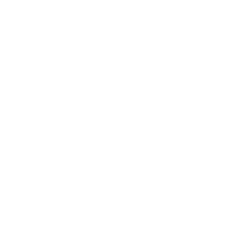
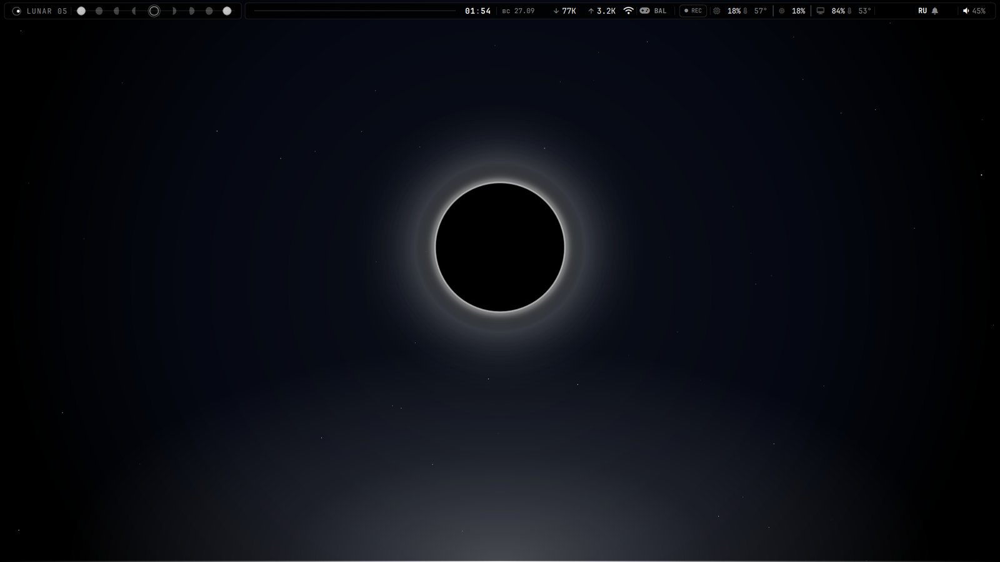
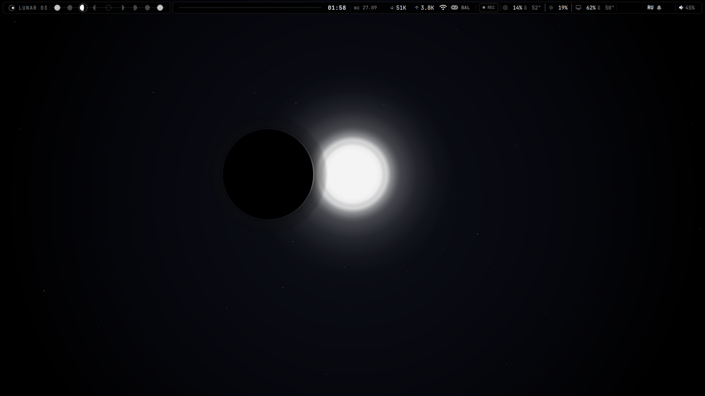
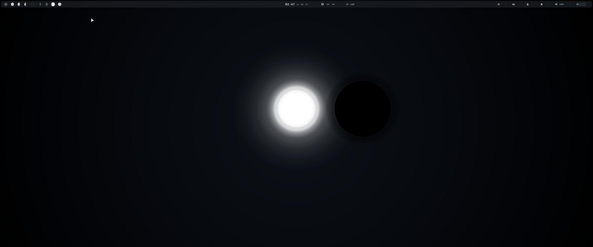
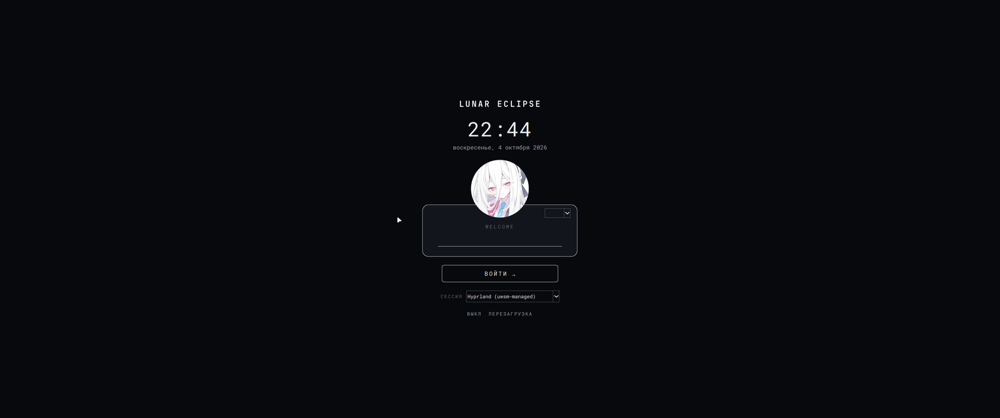
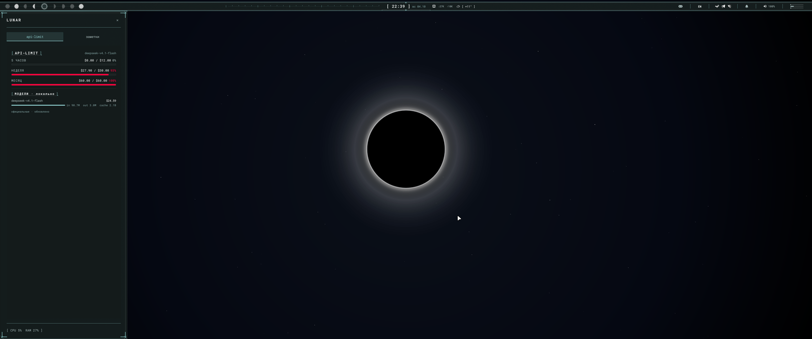
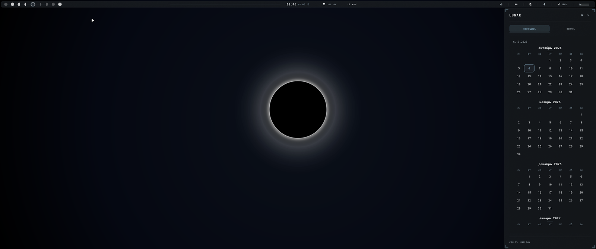
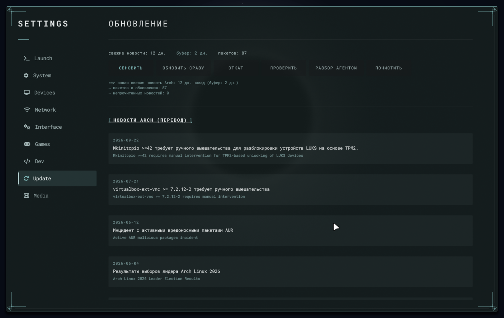

<div align="center">



# Lunar Eclipse

**Hyprland · Quickshell · монохромный HUD**

Весь рабочий стол — панель, лаунчер, сайдбары, живые обои, чат и обновления — на Qt Quick (Quickshell). Ни waybar, ни GTK-обвязки.

   

<br>



</div>

## Коротко

- **Панель** — три плавающих острова: марка и фазы столов · часы · телеметрия и управление.
- **Hub** — лаунчер и настройки одним окном, которое ресайзится (`SUPER + G`).
- **Палитра** — один источник цвета (три пресета) на шелл, kitty, GTK, qt6ct, mako, btop, yazi.
- **Обои** — живая сцена затмения на Qt Quick; фаза = номер рабочего стола.
- **Шрифт** — Iosevka NFM в интерфейсе, JetBrainsMono NF для иконок.

## Содержание

- [Столы](#столы) · [Обои](#обои) · [Палитра и тема](#палитра-и-тема)
- [Установка](#установка) · [Загрузка](#загрузка) · [Экран входа](#экран-входа)
- [Zapret и Vencord](#zapret-и-vencord) · [Игры](#игры-game-mode) · [NVIDIA](#nvidia)
- [Чат](#чат-opencode) · [Календарь](#календарь) · [Обновления](#обновления)
- [Компоненты](#компоненты) · [Горячие клавиши](#горячие-клавиши) · [Если что-то сломалось](#если-что-то-сломалось)

## Столы

| Стол | Назначение |
|---|---|
| **01** | игры (Steam, Heroic, Lutris) |
| **02** | браузер (Firefox) |
| **03** | Discord |
| **04** | Steam |
| **05** | затмение — пустой |
| **06** | кодинг (VS Code, Zed, JetBrains) |
| **07–08** | пустые |
| **09** | btop — автозапуск |

Иконки столов в панели — ряд фаз: `01`/`09` полная луна, `02–04` серпы со светом слева, `05` кольцо, `06–08` серпы со светом справа. Остальные приложения открываются на текущем столе (правило `app_ws` в `hyprland.lua`).

## Обои

Живые обои рисует Quickshell (`LunarWallpaper.qml`) — фоновый слой Qt Quick, без внешних движков. Фаза = активный стол (1..9): луна идёт слева направо, на 5 — полное затмение (кольцо, пыль, метеоры).

| Частичное | Полное | Открытая луна |
|:---:|:---:|:---:|
|  |  |  |

Тумблер **живые / лёгкий режим** — **Hub → Interface**. Превью сцены без Hyprland: `qml6 .config/quickshell/preview.qml` (`1..9` — фазы, `L` — лёгкий режим).

## Палитра и тема

Цвета живут в одном месте — `.config/lunar/palette.toml`. Генератор `hypr/scripts/eclipse-palette.py` раскладывает их по приложениям:

```
palette.toml ──> eclipse-palette.py ──┬──> ~/.cache/lunar/palette.json   (читает Theme.qml)
                                      ├──> kitty/lunar-theme.conf        (include)
                                      ├──> gtk-3.0 · gtk-4.0/lunar-colors.css (@import)
                                      ├──> qt6ct/colors/lunar.conf
                                      ├──> mako/colors.conf              (include)
                                      ├──> btop/themes/lunar.theme
                                      └──> yazi/flavors/lunar.yazi/
```

Пресеты — **LUNAR** (холодный монохром, по умолчанию), **GRAPHITE** (чёрный, по мотивам 43PR), **STEEL** (серо-синий с тихим акцентом). Переключение — **Hub → Interface**; kitty и mako перечитывают конфиг сразу, остальные — при следующем запуске.

```bash
~/.config/hypr/scripts/eclipse-palette.py                 # показать план (dry-run)
~/.config/hypr/scripts/eclipse-palette.py --preset steel  # другой пресет
~/.config/hypr/scripts/eclipse-palette.py --apply         # разложить цвета
```

Ритм интерфейса — токены в `quickshell/Theme.qml`: отступы `space1..6` (4/8/12/16/24/32), высоты строк `rowHCompact/rowH/rowHComfy` (34/42/48), радиусы `radius/radiusM/radiusL/radiusXL` (8/10/12/16), шкала шрифтов `fontTiny..fontTitle` (10/11/13/20), геометрия панели (`barH`, `barGap`, `barMargin`, `barPad`). Меняешь токен — меняется весь рис.

**Hub → Interface**: прозрачность, размытие, размер шрифта, тумблер **OPTIMIZE**, пресеты палитры, курсор Bibata-Modern-Ice. Размытие и профиль сохраняются и переживают `hyprctl reload`.

Палитра по умолчанию: `#08090d` · `#0c0e13` · `#e8ecf2` · `#98a1ac` · акценты белые · опасность `#ff003c`.

## Установка

Нужен **Hyprland 0.55+** (конфиг на Lua) и Arch-подобная система.

```bash
git clone https://github.com/AlanMillerSora/lunar-hyprland.git ~/rice
cd ~/rice
./install.sh             # база: зависимости + конфиги + палитра
./install.sh --sddm      # + тема экрана входа (SDDM)
./install.sh --plymouth  # + заставка при загрузке (меняет загрузку)
./install.sh --zapret    # + обход DPI (Discord/YouTube)
```

| Флаг | Что делает |
|---|---|
| `--no-deps` | только конфиги, без пакетов |
| `--deps-only` | только зависимости |
| `--status` | состояние SDDM / Plymouth / zapret |
| `--disable-sddm` | вернуть штатную тему входа |
| `--disable-plymouth` | выключить заставку |
| `--plymouth-rescue` | пункт меню «без заставки» (UKI) |

Системные темы и сервисы — **SDDM**, **Plymouth**, **zapret** — ставятся только по явному флагу; без них установщик трогает лишь `~/.config` и системные мелочи. Если `yay`/`paru` нет, установщик сам поставит `yay` (иначе VS Code и Vencord пропустятся). Повторный запуск безопасен: прежние конфиги складываются в `~/.config-backup-<дата>/`.

После установки — перелогин в Hyprland (или `hyprctl reload`).

## Загрузка

Заставку рисует своя тема Plymouth `lunar`: кольцо-корона, диск Луны и надпись **LUNAR ECLIPSE** с полосой прогресса. Включается хуком `plymouth`, `quiet splash` в `/etc/kernel/cmdline` и пересборкой UKI. В меню GRUB есть пункт **«Lunar Eclipse (без заставки)»**.

```bash
./install.sh --plymouth               # включить (хук + cmdline + пересборка)
sudo ./install.sh --status            # состояние
sudo ./install.sh --disable-plymouth  # выключить и вернуть загрузку
sudo ./install.sh --plymouth-rescue   # (UKI) пункт меню «без заставки»
```

Тема — `plymouth/lunar/`. На UKI-машине установщик гасит лишний пункт `10_linux` (он создаёт пункт без initramfs); после обновления пакета `grub` права могут сброситься — тогда прогнать `./install.sh --plymouth` заново.

## Экран входа

Тема входа — `lunar` (JetBrains Mono, палитра риса): крупный аватар врезается в карточку, **WELCOME <имя>**, строка пароля с подчёркиванием, индикатор раскладки (клик — переключить) и **CAPS LOCK**, часы, русская дата, кнопка **ВОЙТИ →**, выбор сессии и питание.



```bash
./install.sh --sddm               # поставить и включить тему lunar
sudo ./install.sh --status        # состояние
sudo ./install.sh --disable-sddm  # вернуть штатную тему
```

Предпросмотр без риска: `sddm-greeter --test-mode --theme /usr/share/sddm/themes/lunar`.

**Единый аватар.** Один на всё: `~/.config/avatars/avatar.png` — Hub → User, Hub → System и экран входа. Смена — в **Hub → User → СМЕНИТЬ АВАТАР** (выбор и обрезка) или скриптом:

```bash
~/.config/hypr/scripts/eclipse-avatar.sh pick               # выбрать файл
~/.config/hypr/scripts/eclipse-avatar.sh apply <cs> <cx> <cy>  # обрезать и скруглить
~/.config/hypr/scripts/eclipse-avatar.sh /путь/картинка.png    # поставить готовый файл
```

Синхронизация с темой SDDM идёт через узкое NOPASSWD-правило `/etc/sudoers.d/lunar-agent`.

## Zapret и Vencord

**Zapret — обход DPI.** Оригинальный [zapret](https://github.com/bol-van/zapret) в `/opt/zapret` (+ `zapret.service`), чтобы открывались Discord и YouTube. Управление — **Hub → Network → Zapret**.

```bash
~/.config/hypr/scripts/eclipse-zapret.sh status   # состояние
~/.config/hypr/scripts/eclipse-zapret.sh toggle   # вкл/выкл (+ автозапуск)
~/.config/hypr/scripts/eclipse-zapret.sh update   # обновить и пересобрать
~/.config/hypr/scripts/eclipse-zapret.sh tune     # подобрать стратегию (blockcheck)
```

**Zapret-TG — прокси Telegram.** Локальный MTProto-прокси [tg-ws-proxy](https://github.com/Flowseal/tg-ws-proxy) (AUR `tg-ws-proxy-cli`), слушает `127.0.0.1:1443`, живёт как user-юнит `lunar-tgproxy`. Управление — **Hub → Network → Zapret-TG** (кнопка **ОТКРЫТЬ В TG** открывает `tg://proxy`).

```bash
~/.config/hypr/scripts/eclipse-zapret-tg.sh status   # состояние
~/.config/hypr/scripts/eclipse-zapret-tg.sh toggle   # вкл/выкл
~/.config/hypr/scripts/eclipse-zapret-tg.sh link     # tg://proxy-ссылка
```

Секрет — в `~/.config/lunar/tgproxy.env` (в репозиторий не попадает).

**Vencord — мод Discord.** Вшит в официальный клиент. После обновления Discord — **ПЕРЕПАТЧИТЬ** в **Hub → Network → Vencord**.

```bash
~/.config/hypr/scripts/eclipse-vencord.sh status   # состояние
~/.config/hypr/scripts/eclipse-vencord.sh patch    # закрыть Discord, пропатчить, запустить
~/.config/hypr/scripts/eclipse-vencord.sh update   # обновить инсталлятор и пропатчить
```

## Игры (Game Mode)

`SUPER + SHIFT + G` — анимации и blur выкл, DND, пауза hypridle, tearing. Откладываются обновление, бэкап и пересборка zapret; сервисы из `gamemode-pause.conf` выгружаются и возвращаются при выходе.

## NVIDIA

Переменные включаются, только если карта найдена — один конфиг для NVIDIA и AMD/Intel. Замена проприетарного модуля — **`nvidia-open-dkms`** (user-space — `nvidia-utils`), `get-deps.sh` ставит сам. Turing и новее — `nvidia-open-dkms`; Pascal и старше — legacy `nvidia-580xx-dkms` (AUR).

<details>
<summary>Пакеты, KMS и гибридная графика</summary>

```
nvidia-open-dkms  <ядро>-headers  nvidia-utils  nvidia-settings  libva-nvidia-driver  libva-utils
lib32-nvidia-utils
```

`libva-nvidia-driver` — VAAPI поверх NVENC (аппаратная запись экрана), проверка: `vainfo | grep -i Encoder`. `lib32-nvidia-utils` — те же библиотеки для 32-битных игр Steam/Proton.

**KMS.** С nvidia-utils 560.35.03 DRM включён по умолчанию (`modeset`/`fbdev` = `Y`), иначе нужен `nvidia_drm.modeset=1`. Нужен драйвер **555+**.

**Гибридная графика** автоматически не настраивается: если вывод идёт через iGPU, переменные NVIDIA не включаются. Для принудительного вывода — `AQ_DRM_DEVICES` (Hyprland Wiki → Nvidia).

Уже учтено: `GBM_BACKEND=nvidia-drm`, графики GPU через `nvidia-smi`, VRR (`misc.vrr = 2`), ночной свет `gammastep`.

</details>

## Чат (OpenCode)

Агент [OpenCode](https://opencode.ai) в левом сайдбаре, вывод стримится в UI. «＋» — новая сессия, «▣» — обычный OpenCode в терминале. Агент умеет `sudo` только по белому списку (`/etc/sudoers.d/lunar-agent`); действия сам не выполняет — предлагает карточку и выполняет только из белого списка.



## Календарь

Локальный, без сети: клик по дню в правом сайдбаре → список событий и форма (название, время, за сколько минут напомнить). Точки на днях показывают, где есть события; напоминание приходит уведомлением mako, звук — опцией. События — в `~/.local/share/lunar/calendar.json`, логика — `hypr/scripts/eclipse-calendar.py`.



## Обновления

**Hub → Update** — состояние (буфер, число пакетов), кнопки **ОБНОВИТЬ** / **ОБНОВИТЬ СРАЗУ** / **ОТКАТ** / **ПРОВЕРИТЬ** / **ПОЧИСТИТЬ**, новости Arch с переводом на русский.

`eclipse-update.sh` — буфер 1–2 дня, `informant`, бэкап, `pacman -Syu` (+ AUR), затем гигиена: `paccache -rk2` и журнал ≤ 200 МБ. `eclipse-backup.sh` — ротация 5 бэкапов. **timeshift** — снимки перед обновлением; откат — кнопкой **ОТКАТ**.



## Компоненты

| Компонент | Файл | Что делает |
|---|---|---|
| **Обои** | `quickshell/LunarWallpaper.qml`, `LunarWallpaperScene.qml` | Живая сцена затмения (Qt Quick): фаза по столу 1–9, звёзды, метеоры, пыль. Превью — `preview.qml` |
| **Панель** | `quickshell/LunarPanel.qml` | 36px, три острова: слева `LUNAR` + фазы, в центре часы с датой (и медиа, когда играет), справа — сеть, Game Mode, PERF, REC, CPU/RAM/°C/GPU, трей, раскладка, уведомления, громкость |
| **Hub** | `quickshell/LunarHub.qml` | Лаунчер + настройки (1320×820, ресайзится): Launch, System, Devices, Network, Interface, Games, Dev, Update |
| **Sidebar** | `quickshell/LunarSidebar.qml` | Слева (560px): чат OpenCode, буфер cliphist (ПКМ — удалить), заметки |
| **Sidebar R** | `quickshell/LunarSidebarRight.qml` | Справа: уведомления (mako), «сейчас играет» (MPRIS), календарь, запись экрана |
| **Палитра** | `.config/lunar/palette.toml`, `hypr/scripts/eclipse-palette.py` | Один источник цвета: пресеты LUNAR/GRAPHITE/STEEL → шелл, kitty, GTK3/4, qt6ct, mako, btop, yazi |
| **Тема** | `quickshell/Theme.qml` | Токены ритма и палитра; прозрачность, размер шрифта, число значков трея, размытие сохраняются |
| **Очистка** | `SettingsPages/…`, `hypr/scripts/eclipse-cleanup.sh` | RAM/SWAP и кнопка «ОЧИСТИТЬ»: сироты, кэш, журнал, tmpfiles |
| **Game Mode** | `hypr/scripts/eclipse-gamemode.sh` | Анимации/blur выкл, DND, пауза hypridle, tearing + пауза фоновых задач |
| **Запись** | `hypr/scripts/eclipse-record.sh` | wf-recorder → `~/Videos/lunar-*.mp4`; аппаратный кодек (VAAPI/NVENC) с откатом на софт. Качество — Hub → System |
| **Меню питания** | `quickshell/LunarPower.qml` | Спящий/гибернация/выход/перезагрузка/выключение — `SUPER + ESC` |
| **Dev** | `SettingsPages/DevPage.qml` | Находит git-проекты: ветка, изменения, коммит; кнопки VS Code, терминал, GIT-панель |
| **Firefox** | `firefox/chrome/userChrome.css`, `firefox/user.js` | Тёмный монохром, вертикальные вкладки, без рекламы и телеметрии; своя страница новой вкладки |
| **Файлы** | `gtk-3.0/gtk.css`, `gtk-4.0/gtk.css` | Thunar в монохроме риса (`SUPER + E`); yazi — в терминале (`y`) |

## Горячие клавиши

| Клавиши | Действие |
|---|---|
| `SUPER + RETURN` | Терминал (kitty) |
| `SUPER + G` | Hub: лаунчер + настройки |
| `SUPER + E` | Файлы (Thunar) |
| `SUPER + V` | Буфер обмена (cliphist) |
| `SUPER + SHIFT + E` | Боковая панель (слева) |
| `SUPER + SHIFT + N` | Панель справа (уведомления/музыка/календарь) |
| `SUPER + SHIFT + R` | Запись экрана (вкл/выкл) |
| `SUPER + SHIFT + G` | Game Mode (вкл/выкл) |
| `SUPER + SHIFT + D` | Hub: раздел «Разработка» |
| `SUPER + /` | Шпаргалка по хоткеям |
| `SUPER + Q` | Закрыть окно |
| `SUPER + W` / `SHIFT+W` | Развернуть / полный экран |
| `SUPER + F` / `P` / `SPACE` | Плавающее / псевдо / следующее |
| `SUPER + SHIFT + P` | Закрепить окно поверх |
| `SUPER + TAB` / `SHIFT+TAB` | Следующее / предыдущее окно |
| `SUPER + ←↑↓→` / `HJKL` | Фокус |
| `SUPER + SHIFT + ←↑↓→` | Перенос окна |
| `SUPER + 1…9` | Рабочий стол (фаза затмения) |
| `SUPER + SHIFT + 1…9` | Перенести окно на стол |
| `SUPER + T` / `SHIFT+T` | Группа / закрепить |
| `SUPER + S` / `SHIFT+S` | Scratchpad |
| `SUPER + ESC` | Меню питания |
| `PRINT` / `SUPER + PRINT` | Скриншот: область / весь экран (в буфер) |
| `SUPER + SHIFT + PRINT` | Скриншот всего экрана в файл |
| `SUPER + R` | Перезагрузить Hyprland |

Сжимаемая шпаргалка по всем хоткеям — `SUPER + /`.

## Если что-то сломалось

```bash
systemctl --user restart lunar-quickshell.service        # перезапуск
systemctl --user status  lunar-quickshell.service        # что случилось
systemctl --user reset-failed lunar-quickshell.service   # если «start-limit-hit»
```

Юнит ловит серию падений (5 за 30 с) и по `OnFailure` пишет диагностику в `~/.cache/lunar/quickshell-failure.log` и в уведомление. Не помогло — запусти вручную: `quickshell`.

Откат: конфиги — `git -C ~/rice checkout -- .config`; система — снимком timeshift (Hub → Update → **ОТКАТ**).

## Лицензия

[MIT](LICENSE)
