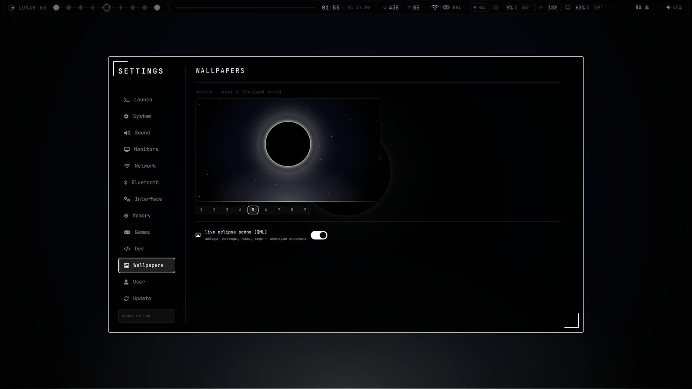
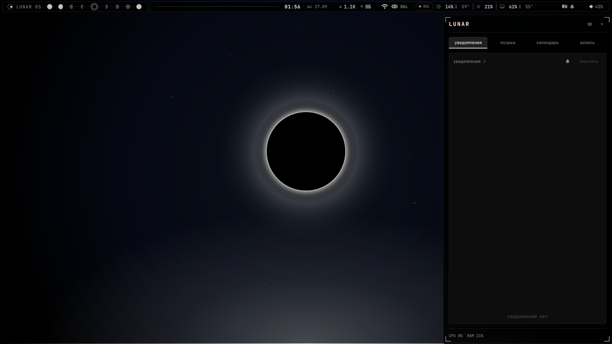

<div align="center">


# Lunar Eclipse

**Hyprland rice · монохромный HUD · весь шелл на Quickshell**

Монохромный райс для Arch Linux: панель, лаунчер, сайдбары, живые обои, чат и обновления.

   

<br>


</div>

---

<h2 align="center" id="содержание">Содержание</h2>

<div align="center">

[Столы](#столы) · [Обои](#обои) · [Установка](#установка) · [Загрузка](#загрузка) · [Экран входа](#экран-входа) · [Zapret и Vencord](#zapret-и-vencord) · [Игры](#игры-game-mode) · [NVIDIA](#nvidia) · [Чат](#чат-opencode) · [Календарь](#календарь) · [Обновления](#обновления) · [Горячие клавиши](#горячие-клавиши) · [Тема](#тема)

</div>

---

<h2 align="center" id="столы">Столы</h2>

<div align="center">

| Стол | Назначение |
|---|---|
| **01** | игры (Steam, Heroic, Lutris) |
| **02** | браузер (Firefox) |
| **03** | Discord |
| **04** | Steam |
| **05** | затмение — пустой |
| **06** | кодинг (VS Code, Zed, JetBrains) |
| **07–08** | пустые |
| **09** | btop — автозапуск |

Иконки столов в панели — ряд фаз: `01`/`09` полная луна, `02–04` серпы со светом слева, `05` кольцо, `06–08` серпы со светом справа. Остальные приложения — на текущем столе (`app_ws` в `hyprland.lua`).

</div>

---

<h2 align="center" id="обои">Обои</h2>

<div align="center">

Живые обои рисует Quickshell (`LunarWallpaper.qml`) — фоновый слой QtQuick, без внешних движков. Фаза = активный стол (1..9): луна идёт слева направо, на 5 — полное затмение (кольцо, пыль, метеоры). Тумблер **живые / лёгкий режим** — **Hub → Wallpapers**.

Превью сцены без Hyprland: `qml6 .config/quickshell/preview.qml` (1..9 — фазы, `L` — лёгкий режим).

</div>

<h3 align="center">Фазы — по активному столу</h3>

<div align="center">

| Частичное | Полное | Открытая луна |
|:---:|:---:|:---:|
|  |  |  |

</div>

<h3 align="center">Живые / лёгкий режим — Hub → Wallpapers</h3>

<div align="center">



</div>

<details>
<summary>Превью сцены без Hyprland</summary>

<br>

Требуется только Qt6: `qml6 .config/quickshell/preview.qml` — клавиши `1..9` переключают фазы, `L` — лёгкий режим.

</details>

---

<h2 align="center" id="установка">Установка</h2>

<div align="center">

Требуется **Hyprland 0.55+** (конфиг на Lua).

</div>

```bash
git clone https://github.com/AlanMillerSora/lunar-hyprland.git ~/rice
cd ~/rice

./install.sh             # база: зависимости + конфиги
./install.sh --sddm      # + тема экрана входа (SDDM)
./install.sh --plymouth  # + заставка при загрузке (меняет загрузку)
./install.sh --zapret    # + обход DPI (Discord/YouTube)
```

Системные темы и сервисы — **SDDM**, **Plymouth**, **zapret** — ставятся только по явному флагу; без них установщик трогает лишь `~/.config` и системные мелочи. Состояние: `./install.sh --status`; откат: `--disable-sddm` / `--disable-plymouth`. Флаги: `--no-deps` — только конфиги, `--deps-only` — только зависимости. `./get-deps.sh` запускается и отдельно. Если `yay`/`paru` нет, установщик сам поставит `yay` (из AUR) — иначе VS Code и Vencord пропустятся.

<div align="center">

Перелогинься в Hyprland (или `hyprctl reload`). Повторный запуск `install.sh` безопасен: прежние правки складываются в `~/.config-backup-<дата>/`.

</div>

---

<h2 align="center" id="загрузка">Загрузка (Plymouth)</h2>

<div align="center">

Заставку при загрузке рисует своя тема Plymouth — `lunar`: кольцо-корона, диск Луны и надпись **LUNAR ECLIPSE** с полосой прогресса. Включена через hook `plymouth`, `quiet splash` в `/etc/kernel/cmdline` и пересборку UKI. На случай проблем в меню GRUB есть пункт **«Lunar Eclipse (без заставки)»** — система грузится без неё.

</div>

```bash
./install.sh --plymouth               # включить (hook + cmdline + пересборка)
sudo ./install.sh --status            # состояние SDDM / Plymouth / zapret
sudo ./install.sh --disable-plymouth  # выключить и вернуть загрузку
sudo ./install.sh --plymouth-rescue   # (UKI) пункт меню «без заставки»
```

<div align="center">

Тема — `plymouth/lunar/`. Установщик сам гасит лишний пункт `10_linux` (на UKI-машине он создаёт пункт без initramfs): после обновления пакета `grub` права могут сброситься — тогда прогнать `./install.sh --plymouth` заново.

</div>

---

<h2 align="center" id="экран-входа">Экран входа (SDDM)</h2>

<div align="center">

Тема входа — `lunar` (JetBrains Mono, палитра риса): крупный аватар врезается в карточку, **WELCOME <имя>**, строка пароля с подчёркиванием, индикатор раскладки (клик — переключить) и **CAPS LOCK**, часы, русская дата, кнопка **ВОЙТИ →**, выбор сессии и питание.

<br>


</div>

```bash
./install.sh --sddm               # поставить и включить тему lunar
sudo ./install.sh --status        # состояние SDDM / Plymouth / zapret
sudo ./install.sh --disable-sddm  # вернуть штатную тему
```

<div align="center">

Предпросмотр без риска: `sddm-greeter --test-mode --theme /usr/share/sddm/themes/lunar`.

</div>

<details>
<summary>Единый аватар</summary>

<br>

Аватар один на всё: `~/.config/avatars/avatar.png` — используется в **Hub → User**, **Hub → System** и на экране входа SDDM. Смена — в **Hub → User → СМЕНИТЬ АВАТАР** (выбор и обрезка) или скриптом:

- `eclipse-avatar.sh pick` — выбрать файл через zenity;
- `eclipse-avatar.sh apply <cs> <cx> <cy>` — обрезать и скруглить в круг;
- `eclipse-avatar.sh /путь/картинка.png` — поставить готовый файл (авто-кроп по центру).

Синхронизация с темой SDDM идёт через узкое NOPASSWD-правило `/etc/sudoers.d/lunar-agent`.

</details>

---

<h2 align="center" id="zapret-и-vencord">Zapret и Vencord</h2>

<h3 align="center">Zapret — обход DPI</h3>

<div align="center">

Оригинальный [zapret](https://github.com/bol-van/zapret) в `/opt/zapret` (+ `zapret.service`), чтобы открывались **Discord** и **YouTube**. Управление — **Hub → Network → Zapret** или:

<br>


</div>

```bash
~/.config/hypr/scripts/eclipse-zapret.sh status   # состояние
~/.config/hypr/scripts/eclipse-zapret.sh toggle   # вкл/выкл (+ автозапуск)
~/.config/hypr/scripts/eclipse-zapret.sh update   # обновить и пересобрать
~/.config/hypr/scripts/eclipse-zapret.sh tune     # подобрать стратегию (blockcheck)
```

<div align="center">

`update` — `git pull` → `make systemd` → `systemctl restart zapret`; если провайдер сменил DPI — `tune`. Для переключателя в Hub — узкое NOPASSWD-правило `/etc/sudoers.d/lunar-zapret`.

</div>

<h3 align="center">Zapret-TG — прокси Telegram</h3>

<div align="center">

Локальный MTProto-прокси [tg-ws-proxy](https://github.com/Flowseal/tg-ws-proxy) (AUR `tg-ws-proxy-cli`), чтобы Telegram грузился при блокировках. Слушает `127.0.0.1:1443`, живёт как systemd `--user`-юнит `lunar-tgproxy` и включён в автозапуск. Управление — **Hub → Network → Zapret-TG** (кнопка **ОТКРЫТЬ В TG** открывает `tg://proxy`, Telegram сам подключает прокси):

</div>

```bash
~/.config/hypr/scripts/eclipse-zapret-tg.sh status   # состояние
~/.config/hypr/scripts/eclipse-zapret-tg.sh toggle   # вкл/выкл (+ автозапуск)
~/.config/hypr/scripts/eclipse-zapret-tg.sh link     # tg://proxy-ссылка
```

<div align="center">

Секрет генерируется при установке и лежит в `~/.config/lunar/tgproxy.env` (в репозиторий не попадает).

</div>

<h3 align="center">Vencord — мод Discord</h3>

<div align="center">

Вшит в официальный клиент. После обновления Discord — **ПЕРЕПАТЧИТЬ** в **Hub → Network → Vencord** или:

</div>

```bash
~/.config/hypr/scripts/eclipse-vencord.sh status   # состояние
~/.config/hypr/scripts/eclipse-vencord.sh patch    # закрыть Discord, пропатчить, запустить
~/.config/hypr/scripts/eclipse-vencord.sh update   # обновить инсталлятор (AUR) и пропатчить
```

<div align="center">

Настройки — в клиенте: **User Settings → Vencord**.

</div>

---

<h2 align="center" id="игры-game-mode">Игры (Game Mode)</h2>

<div align="center">

`SUPER + SHIFT + G` — анимации/blur выкл, DND, профиль performance, пауза hypridle, tearing. Откладываются обновление/бэкап/zapret-пересборка; сервисы из `gamemode-pause.conf` выгружаются и возвращаются при выходе.

</div>

---

<h2 align="center" id="nvidia">NVIDIA</h2>

<div align="center">

Переменные включаются, только если карта найдена — один конфиг для NVIDIA и AMD/Intel. Замена проприетарного модуля — **`nvidia-open-dkms`** (user-space — `nvidia-utils`), `get-deps.sh` ставит сам.

Turing и новее — `nvidia-open-dkms`; Pascal и старше — legacy `nvidia-580xx-dkms` (AUR).

</div>

<details>
<summary>Пакеты, KMS и гибридная графика</summary>

<br>

```text
nvidia-open-dkms  <ядро>-headers  nvidia-utils  nvidia-settings  libva-nvidia-driver  libva-utils
lib32-nvidia-utils
```

`libva-nvidia-driver` — VAAPI поверх NVENC (аппаратная запись экрана); проверка: `vainfo | grep -i Encoder`. `lib32-nvidia-utils` — те же библиотеки для 32-битных игр Steam/Proton.

**KMS.** С nvidia-utils 560.35.03 DRM включён по умолчанию (`modeset`/`fbdev` = `Y`); иначе kernel-параметр `nvidia_drm.modeset=1`. Нужен драйвер **555+**.

**Гибридная графика** автоматически не настраивается: если вывод идёт через iGPU, переменные NVIDIA не включаются. Для принудительного вывода — `AQ_DRM_DEVICES` (Hyprland Wiki → Nvidia).

Уже учтено: `GBM_BACKEND=nvidia-drm`, графики GPU через `nvidia-smi`, VRR (`misc.vrr = 2`), ночной свет `gammastep`.

</details>

---

<h2 align="center" id="чат-opencode">Чат (OpenCode)</h2>

<div align="center">

Агент [OpenCode](https://opencode.ai) в левом сайдбаре, вывод стримится в UI. «＋» — новая сессия, «▣» — обычный OpenCode в терминале. Агент умеет `sudo` только по белому списку (`/etc/sudoers.d/lunar-agent`), остальное от root — после подтверждения в чате.

<br>


</div>

---

<h2 align="center" id="календарь">Календарь</h2>

<div align="center">

Локальный, без сети: клик по дню в правом сайдбаре → список событий и форма (название, время, за сколько минут напомнить). Точки на днях показывают, где есть события; напоминание приходит уведомлением mako, звук — опцией. События хранятся в `~/.local/share/lunar/calendar.json`, логика — `hypr/scripts/eclipse-calendar.py`. Синхронизация CalDAV (Google/Nextcloud) — следующим этапом.

<br>


</div>

---

<h2 align="center" id="обновления">Обновления</h2>

<div align="center">

**Hub → Update** — состояние (буфер, число пакетов), кнопки **ОБНОВИТЬ** / **ОБНОВИТЬ СРАЗУ** / **ОТКАТ** / **ПРОВЕРИТЬ** / **ПОЧИСТИТЬ**, новости Arch с переводом на русский.

`eclipse-update.sh` — буфер 1–2 дня, `informant`, бэкап, `pacman -Syu` (+AUR), затем гигиена: `paccache -rk2` и журнал ≤200 МБ; кнопка **ПОЧИСТИТЬ** чистит кэш и журнал, показывает пакеты-сироты с подтверждением. `fwupd` проверяет прошивки (тоже с подтверждением). `eclipse-backup.sh` — ротация 5 бэкапов. **timeshift** — снимки перед обновлением; откат — кнопкой «Откат».

<br>


</div>

---

<h2 align="center" id="что-внутри">Что внутри</h2>

<div align="center">

Обои · Панель · Hub · Sidebar'ы · Календарь · OSD · Чат · Game Mode · Обновления — всё на Quickshell (QML), `waybar` и GTK-приложений нет. Один визуальный язык: рамка 1px, радиус 6, HUD-скобки, JetBrains Mono.

</div>

<h3 align="center">Hub — лаунчер и настройки</h3>

<div align="center">

| Launch | System |
|:---:|:---:|
|  |  |

</div>

<h3 align="center">Правый сайдбар</h3>

<div align="center">

Уведомления (mako), «сейчас играет» (MPRIS), календарь и запись экрана — `SUPER + SHIFT + N`.

<br>


</div>

<h3 align="center">Приложения</h3>

<div align="center">

| kitty | btop | yazi | Firefox |
|:---:|:---:|:---:|:---:|
|  |  |  |  |

</div>

<details>
<summary>Полная таблица компонентов</summary>

<br>

| Компонент | Файл | Что делает |
|---|---|---|
| **Обои** | `quickshell/LunarWallpaper.qml`, `LunarWallpaperScene.qml` | Живая сцена затмения на QtQuick (фоновый слой): фаза по столу 1–9, звёзды/метеоры/пыль. Превью — `preview.qml` |
| **Панель** | `quickshell/LunarPanel.qml` | 42px сверху. Лого+фаза, столы `01–09`; справа — пилюля **скорости сети** (Б/К/М), сеть/раскладка/уведомления, Game Mode, питание, CPU/RAM/°C/GPU, mpris, трей, громкость |
| **Hub** | `quickshell/LunarHub.qml` | Лаунчер + настройки (980×640): Launch, System, Sound, Monitors, Network, Bluetooth, Interface, Memory, Games, Dev, Wallpapers, User, Update |
| **Sidebar** | `quickshell/LunarSidebar.qml` | Слева (560px): чат OpenCode, буфер cliphist (ПКМ — удалить), заметки |
| **Sidebar R** | `quickshell/LunarSidebarRight.qml` | Справа: уведомления (mako), «сейчас играет» (mpris), календарь (локальные события и напоминания), запись экрана |
| **Очистка/Система** | `SettingsPages/MemoryPage.qml`, `hypr/scripts/eclipse-cleanup.sh` | RAM/SWAP и кнопка «ОЧИСТИТЬ»: сироты, кэш, журнал, tmpfiles |
| **Game Mode** | `hypr/scripts/eclipse-gamemode.sh` | Анимации/blur выкл, DND, performance, пауза hypridle, tearing + пауза фоновых задач |
| **Запись** | `hypr/scripts/eclipse-record.sh` | wf-recorder → `~/Videos/lunar-*.mp4`; аппаратный кодек (VAAPI/NVENC) с откатом на софт. Качество (QP), битрейт и герцовку задают переключатели в **Hub → Monitors** (`~/.config/lunar/record.json`) |
| **Меню питания** | `quickshell/LunarPower.qml` | Спящий/гибернация/выход/перезагрузка/выключение — `SUPER + ESC` |
| **Dev** | `SettingsPages/DevPage.qml` | Находит git-проекты, показывает ветку/изменения/коммит; кнопки VS Code, терминал, GIT-панель |
| **Firefox** | `firefox/chrome/userChrome.css`, `firefox/user.js` | Тёмный монохром, вертикальные вкладки, без рекламы и телеметрии; своя страница новой вкладки |
| **Файлы** | `yazi/theme.toml`, `yazi/yazi.toml` | yazi в монохроме (`SUPER + E`); превью картинок, PDF, шрифтов, видео |
| **Тема** | `quickshell/Theme.qml` | Палитра, радиусы, шрифты; прозрачность, размер шрифта, число значков трея, **размытие** и профиль **NORMAL/OPTIMIZE** сохраняются |

</details>

---

<h2 align="center" id="горячие-клавиши">Горячие клавиши</h2>

<details>
<summary>Смотреть таблицу</summary>

| Клавиши | Действие |
|---|---|
| `SUPER + RETURN` | Терминал (kitty) |
| `SUPER + G` | Hub: лаунчер + настройки |
| `SUPER + E` | Файлы (yazi) |
| `SUPER + V` | Буфер обмена (cliphist) |
| `SUPER + SHIFT + E` | Боковая панель (слева) |
| `SUPER + SHIFT + N` | Панель справа (уведомления/музыка/календарь) |
| `SUPER + SHIFT + R` | Запись экрана (вкл/выкл) |
| `SUPER + SHIFT + G` | Game Mode (вкл/выкл) |
| `SUPER + SHIFT + D` | Hub: раздел «Разработка» |
| `SUPER + /` | Шпаргалка по хоткеям |
| `SUPER + Q` | Закрыть окно |
| `SUPER + W` / `SHIFT+W` | Развернуть / полный экран |
| `SUPER + F` / `P` / `SPACE` | Плавающее / псевдо / следующее |
| `SUPER + SHIFT + P` | Закрепить окно поверх |
| `SUPER + TAB` / `SHIFT+TAB` | Следующее / предыдущее окно |
| `SUPER + ←↑↓→` / `HJKL` | Фокус |
| `SUPER + SHIFT + ←↑↓→` | Перенос окна |
| `SUPER + 1…9` | Рабочий стол (фаза затмения) |
| `SUPER + SHIFT + 1…9` | Перенести окно на стол |
| `SUPER + T` / `SHIFT+T` | Группа / закрепить |
| `SUPER + S` / `SHIFT+S` | Scratchpad |
| `SUPER + ESC` | Меню питания (Quickshell) |
| `PRINT` / `SUPER + PRINT` | Скриншот: область / весь экран (в буфер) |
| `SUPER + SHIFT + PRINT` | Скриншот всего экрана в файл |
| `SUPER + R` | Перезагрузить Hyprland |

</details>

<div align="center">

Сжимаемая шпаргалка по всем хоткеям — <code>SUPER + /</code>.

<br>


</div>

---

<h2 align="center" id="тема">Тема</h2>

<div align="center">

**Hub → Interface**: прозрачность, размытие, размер шрифта, производительность **NORMAL / OPTIMIZE**, курсор Bibata-Modern-Ice. Размытие и профиль сохраняются и переживают `hyprctl reload`.

<br>


Палитра: `#050505` · `#ffffff` · `#888888` · акценты белые · опасность `#ff003c`.

</div>

<details>
<summary>Если Quickshell отвалился</summary>

<br>

```bash
systemctl --user restart lunar-quickshell.service   # перезапуск
systemctl --user status  lunar-quickshell.service   # что случилось
systemctl --user reset-failed lunar-quickshell.service   # если юнит не поднимается («start-limit-hit»)
```

Юнит ловит серию падений (5 за 30 с) и по `OnFailure` пишет диагностику в
`~/.cache/lunar/quickshell-failure.log` и в уведомление. Сброс — команда
`reset-failed` выше (она же стоит в `hyprland.lua` перед перезапуском шелла).

Не помогло — запусти вручную: `quickshell`. Откат: конфиги — `git -C ~/rice checkout -- .config`, система — снимком timeshift (Hub → Update → **ОТКАТ**).

</details>

---

<h2 align="center" id="лицензия">Лицензия</h2>

<div align="center">

[MIT](LICENSE)

</div>
