<div align="center">


# Lunar Eclipse

**Hyprland · Quickshell · монохромный HUD**

Весь рабочий стол — панель, лаунчер, сайдбары, живые обои, плеер, агент и обновления — на Qt Quick (Quickshell). Ни waybar, ни GTK-обвязки.

   

<br>


</div>

<div align="center">

## Коротко

</div>

- **Панель** — одна плашка по содержимому: марка и фазы столов · медиа/часы · статус (сеть, погода, Game Mode, PERF, CPU·RAM·GPU, трей, звук). «Пульт» и поиск раскрывают саму плашку, остальные режимы выезжают карточкой снизу (`SUPER + C/X/D/N/I`, Esc закрывает).
- **Hub** — лаунчер и настройки одним окном, которое ресайзится (`SUPER + G`): Launch, System, Devices, Network, Interface, Games, Dev, Update, Media.
- **Палитра** — один источник цвета на шелл, kitty, GTK, qt6ct, mako, btop, yazi, fastfetch, bat и KDE-схему. Пресеты **LUNAR / GRAPHITE / STEEL / ФОТО**.
- **Обои** — живая сцена затмения на Qt Quick (фаза = номер стола) или картинка с диска; подбор — веером по `SUPER + B`.
- **Плеер** — свой mpv-демон и окно `Lunar Player`: очередь, поиск (yt-dlp), локальная музыка, винил и cava.
- **Агент** — OpenCode в оверлее по `SUPER + A`, действия только из белого списка.
- **Шрифт** — Roboto Mono в интерфейсе, JetBrainsMono Nerd Font для иконок.

<div align="center">

## Содержание

</div>

- [Столы](#столы) · [Панель и режимы](#панель-и-режимы) · [Hub](#hub) · [Сайдбары](#сайдбары)
- [Обои](#обои) · [Палитра и тема](#палитра-и-тема) · [Плеер](#плеер) · [Обзор столов](#обзор-столов)
- [Агент OpenCode](#агент-opencode) · [Календарь](#календарь) · [Запись экрана](#запись-экрана) · [Обновления](#обновления)
- [Буфер обмена](#буфер-обмена) · [Питание](#питание) · [Шпаргалка](#шпаргалка)
- [Установка](#установка) · [Загрузка](#загрузка) · [Экран входа](#экран-входа)
- [Zapret и Vencord](#zapret-и-vencord) · [Игры](#игры-game-mode) · [NVIDIA](#nvidia)
- [Приложения](#приложения) · [Компоненты](#компоненты) · [Горячие клавиши](#горячие-клавиши)
- [Структура репозитория](#структура-репозитория) · [Если что-то сломалось](#если-что-то-сломалось)

<div align="center">

## Столы

</div>

| Стол | Назначение |
|---|---|
| **01** | игры (Steam, Heroic, Lutris, эмуляторы) |
| **02** | браузеры (Firefox) |
| **03** | Discord |
| **04** | Vesktop |
| **05** | затмение — пустой |
| **06** | кодинг (VS Code, Zed, JetBrains) |
| **07–08** | пустые |
| **09** | btop — автозапуск |

Иконки столов в панели — ряд фаз луны: `01`/`09` полная, `02–04` серпы со светом слева, `05` кольцо (полное затмение), `06–08` серпы со светом справа. При наведении (или при переключении — короткий «пик») фаза показывает иконку приложения стола; новое окно на неактивном столе мигает. Приложения раскладываются по столам правилом `app_ws` в `hyprland.lua`, остальное открывается на текущем столе.

Автозапуск из `hyprland.start` (тихо, идемпотентно): **Firefox** на стол 2, **Vesktop** на стол 4, **btop** (kitty `--class lunar-btop`) на стол 9. Ещё поднимаются `mako`, `hypridle`, два `wl-paste`-наблюдателя cliphist, скрипт прозрачности и курсор `Bibata-Modern-Ice`.

| Частичное | Полное | Открытая луна |
|:---:|:---:|:---:|
|  |  |  |

<div align="center">

## Панель и режимы

</div>

Панель — одна плашка по ширине содержимого, по центру сверху (`barH` 34, радиус 9). Слева марка `LUNAR` и ряд фаз столов, в центре — **линия медиа** (название трека и cava) и часы, справа — сеть, погода, Game Mode, PERF, систем-остров CPU·RAM·GPU, трей, уведомления, звук. Плашки плотные (альфа 1.0), зерно — тайлом (`assets/noise.png`), без «стекла».

Режимы открываются хоткеями (`SUPER + C/X/D/N/I`) и кликами по ячейкам:

| Режим | Хоткей | Что |
|---|---|---|
| **Пульт** | `SUPER + C` | Плашка звука: вывод и микрофон с выбором устройств и ползунками |
| **Медиа** | `SUPER + X` | Трек, seek «лунный», транспорт, переход к полному плееру |
| **Поиск** | `SUPER + D` | Ланчер: приложения (иконки), секции, недавние на пустом запросе, страницы Hub, действия, счёт, конверсия единиц, эмодзи, ссылки |
| **Уведомления** | `SUPER + N` | История mako: раскрытие, dismiss, «очистить», DND |
| **Телеметрия** | `SUPER + I` | CPU/RAM/GPU с температурой и полосой, скорость сети |

| Пульт | Медиа |
|:---:|:---:|
| 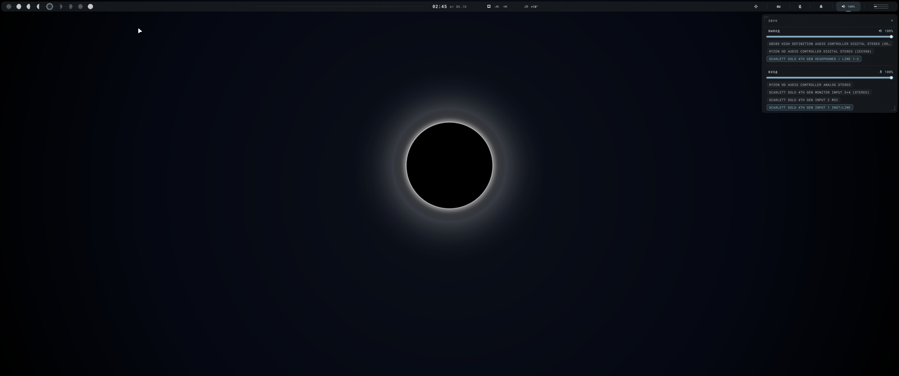 | 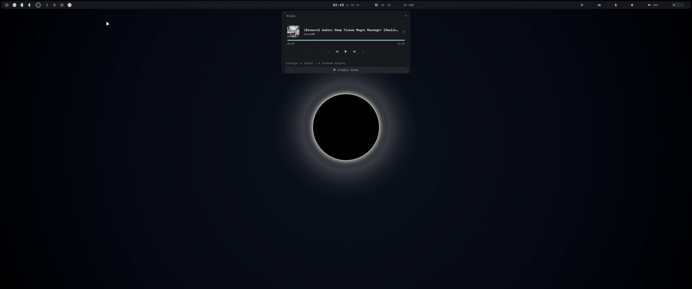 |

| Поиск | Уведомления | Телеметрия |
|:---:|:---:|:---:|
| 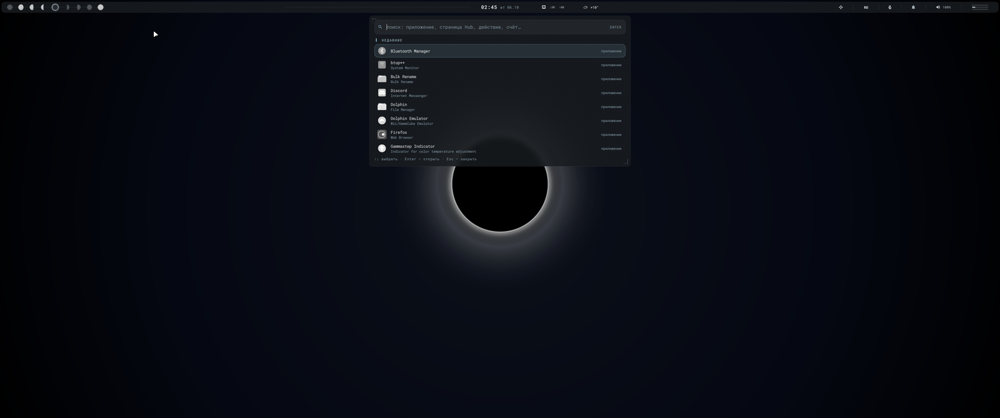 | 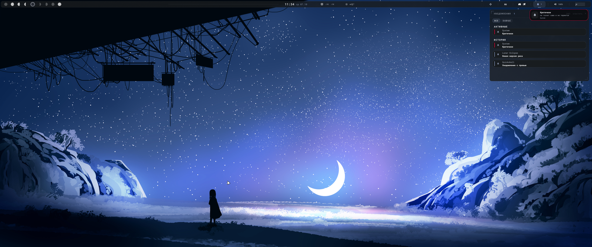 | 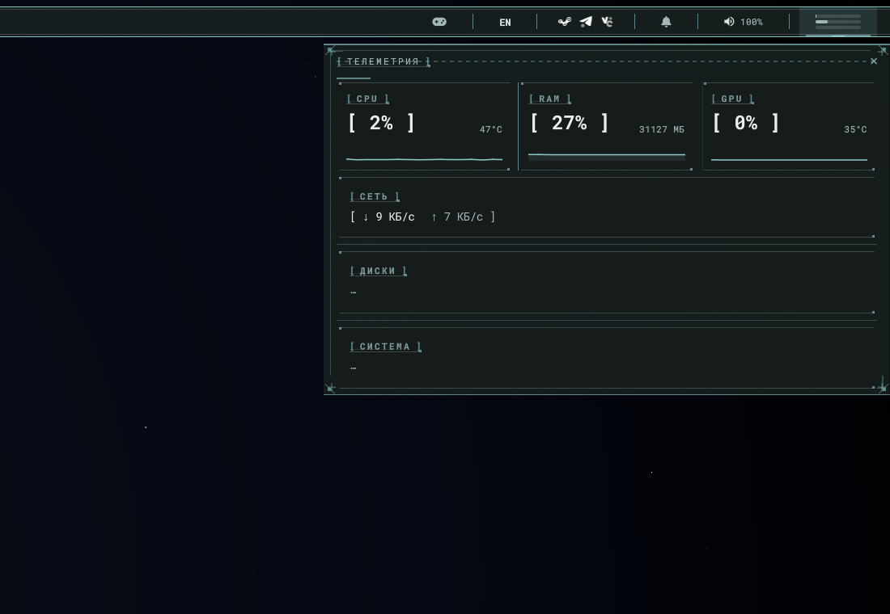 |

Мышь: колесо над часами — громкость; клик по треку / систем-острову / погоде / колоколу / сети — соответствующая панель; ПКМ по громкости — микшер; клик по фазе — переход на стол, наведение — иконка приложения. Ячейки импульсируют при смене громкости, трека, уведомлений (в Game Mode импульсы глушатся, ховер их придерживает). Состояния и состав ячеек живут в `BarState.qml` и `~/.config/lunar/bar.json`, вид — в `LunarPanel.qml`, тела режимов — `panels/Panel*.qml`.

<div align="center">

## Hub

</div>

Hub (`SUPER + G`, `LunarHub.qml`) — лаунчер и настройки одним окном-`FloatingWindow` (1320×820, ресайзится, запоминает размер). Слева навигация, справа страница; снизу — единый поиск. Страницы:

| # | Страница | Что внутри |
|---|---|---|
| 0 | **Launch** | Все приложения сеткой, «избранные»; поиск приложений, счёт |
| 1 | **System** | Система и Память: железо, температуры, RAM/SWAP и кнопка «ОЧИСТИТЬ» |
| 2 | **Devices** | Дисплей (запись) и Звук |
| 3 | **Network** | Wi-Fi (iwd), Сеть, Bluetooth, Zapret, Zapret-TG, Vencord |
| 4 | **Interface** | Интерфейс / Бар / Аватар: прозрачность, размытие, шрифт, OPTIMIZE, палитра, ячейки бара, аватар |
| 5 | **Games** | Игровые клиенты и профили |
| 6 | **Dev** | git-проекты: ветка, изменения, коммит; панель git (ветки/diff/pull/push) |
| 7 | **Update** | Обновления: буфер, кнопки, новости Arch с переводом |
| 8 | **Media** | Галереи: Скриншоты, Картинки, Видео (миниатюры, открытие `xdg-open`) |

| Launch | System | Devices |
|:---:|:---:|:---:|
| 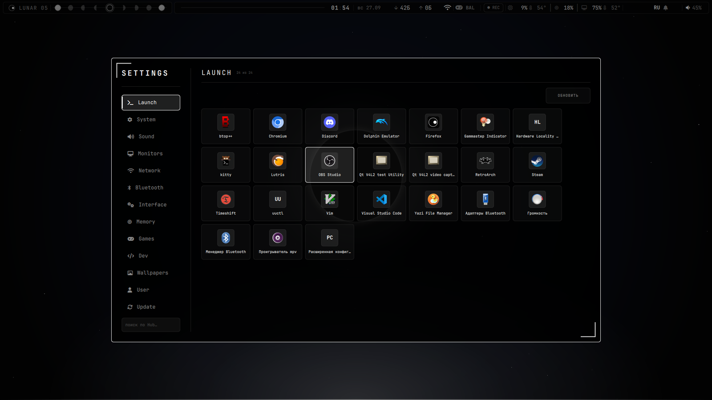 | 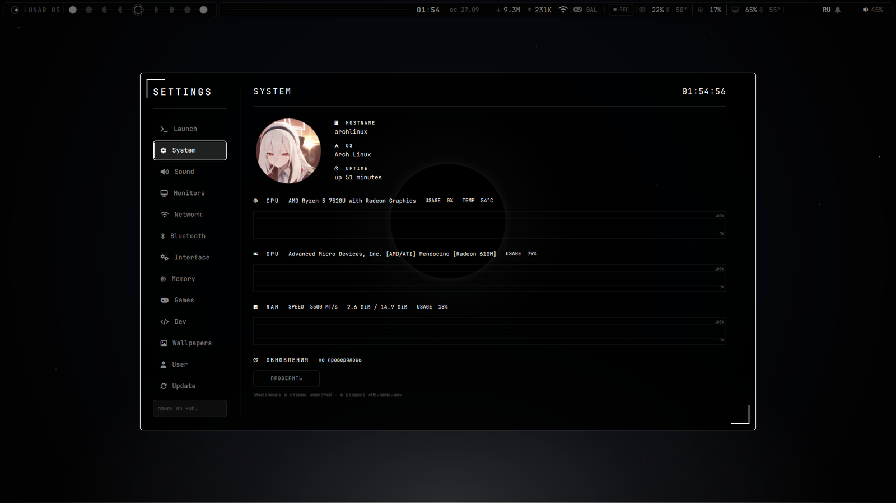 | 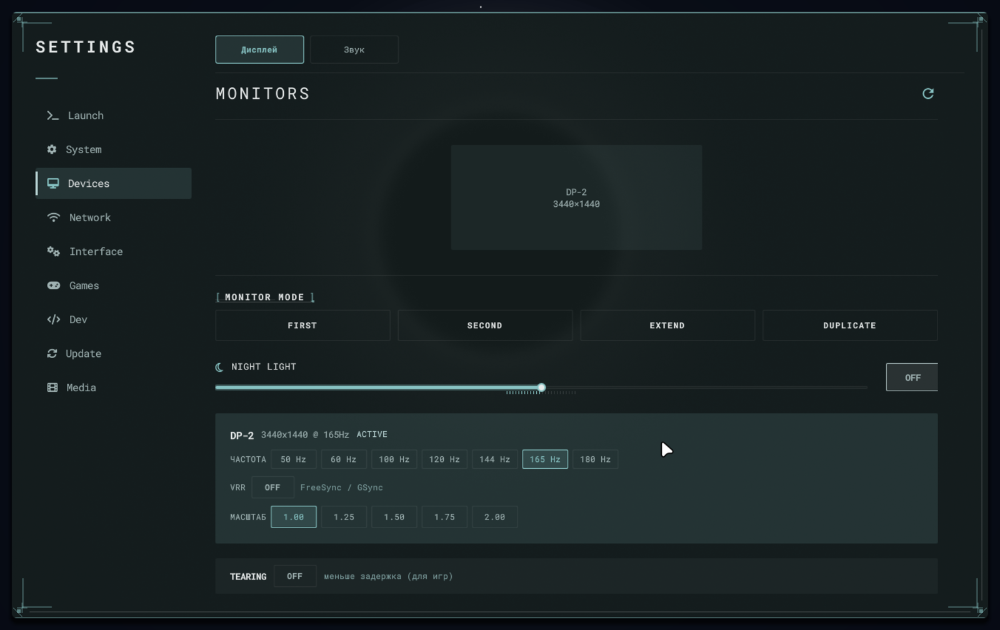 |

| Network | Interface | Games |
|:---:|:---:|:---:|
| 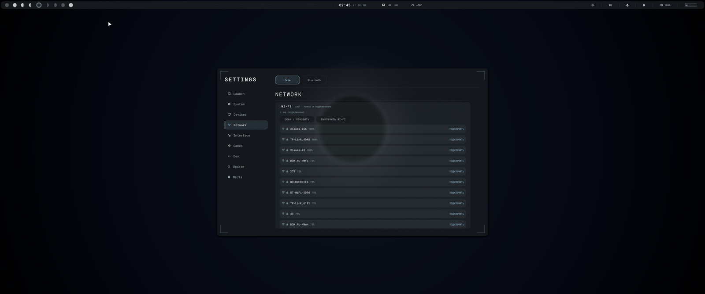 | 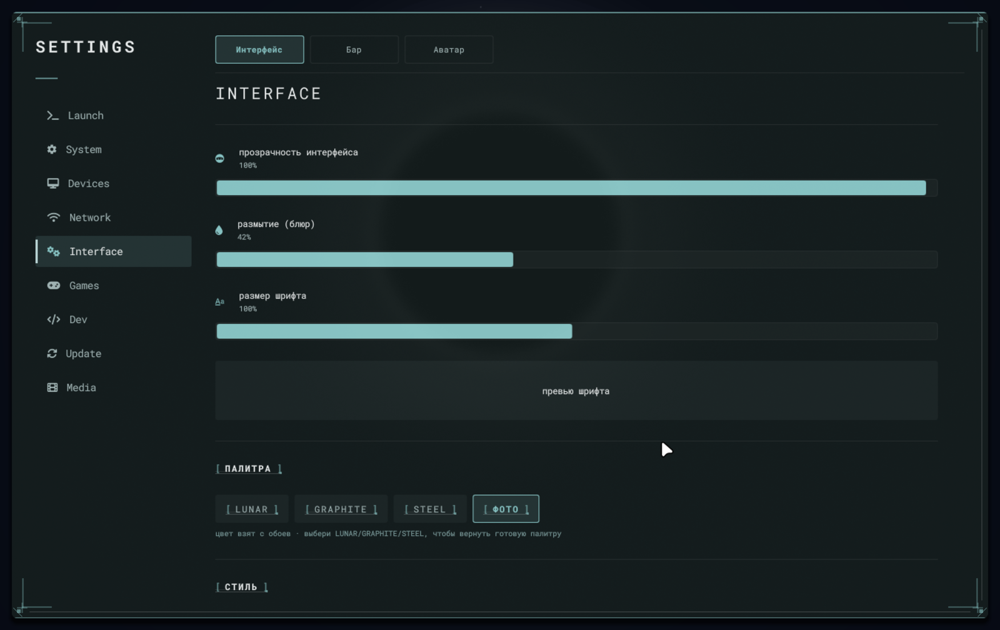 | 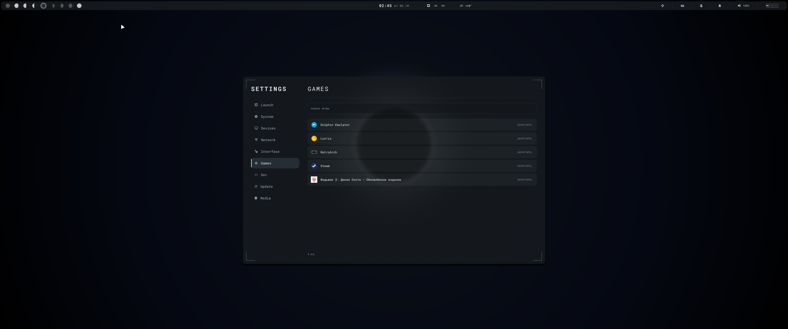 |

| Dev | Update | Media |
|:---:|:---:|:---:|
| 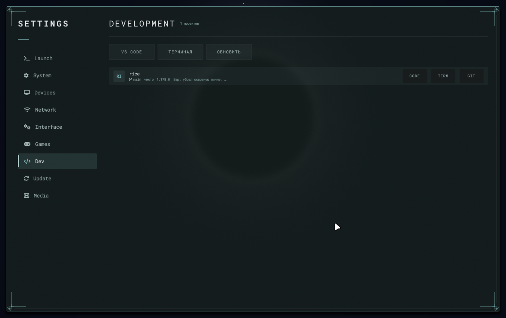 |  | 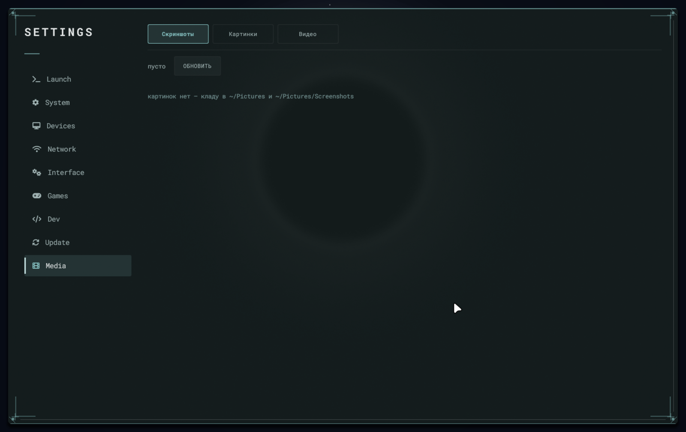 |

<div align="center">

## Сайдбары

</div>

**Слева** (`SUPER + SHIFT + E`, `LunarSidebar.qml`, 560px) — выезд от края, закрывается через 600 мс без наведения:

- **api-limit** — расход лимитов OpenCode Go (часы, 5ч/неделя/месяц, разбивка по моделям; данные собирает `eclipse-api-limit.sh`, ключ не хранит);
- **заметки** — автосохраняемый блокнот (`~/.cache/lunar_notes.txt`).

**Справа** (`SUPER + SHIFT + N`, `LunarSidebarRight.qml`):

- **календарь** — локальный календарь на 18 месяцев, события и напоминания (см. [Календарь](#календарь));
- **запись** — список записей и тумблер записи экрана (см. [Запись экрана](#запись-экрана)).

| Лимиты (лево) | Заметки (лево) |
|:---:|:---:|
|  | 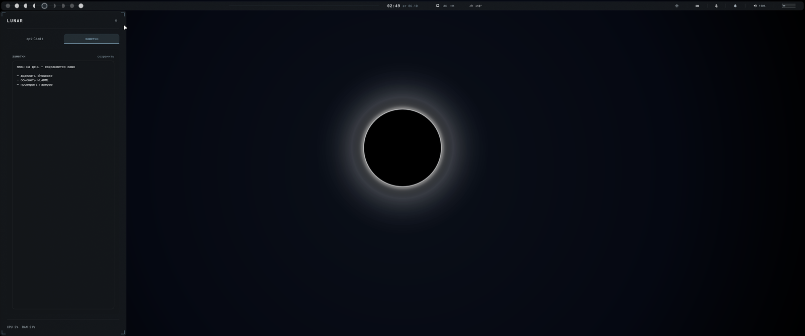 |

| Календарь (право) | Запись (право) |
|:---:|:---:|
|  | 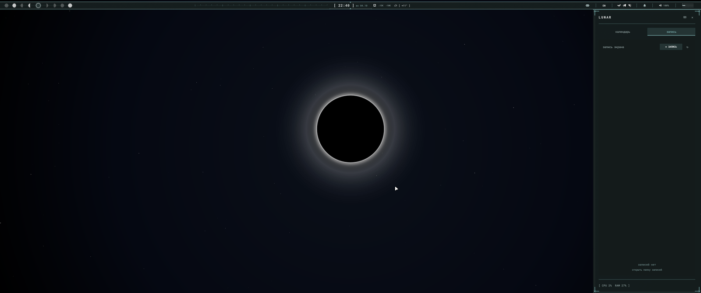 |

<div align="center">

## Обои

</div>

Живые обои рисует Quickshell (`LunarWallpaper.qml`) — фоновый слой Qt Quick, без внешних движков. Два режима (`Theme.wallpaperMode`):

- **scene** — сцена затмения: фаза = активный стол (1..9), луна идёт слева направо, на 5 — полное затмение (кольцо, пыль, метеоры, звёзды). Тумблер «живые / лёгкий (OPTIMIZE)» — **Hub → Interface**;
- **image** — картинка с диска; смена идёт кроссфейдом, в режиме image сцена не тикает.

Подбор обоев — окно **`LunarWallpapers`** (`SUPER + B`): веер плиток с зумом от центра, инерционный глайд, затемнение и подтверждение. Источник — `~/Pictures/Wallpapers` (и `~/Wallpapers`, `~/Pictures`, до 150 картинок), миниатюры — `~/.cache/lunar/wall-thumbs`. Кнопка **СЦЕНА** возвращает режим затмения, **ФАЙЛ…** — выбор произвольной картинки. При `wallpaperAuto` цвет обоев считается автоматически (`--from-image`, пресет **ФОТО**).

<div align="center">

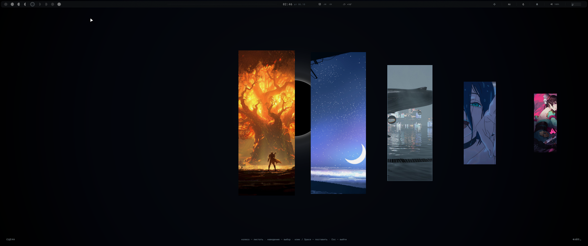

</div>

Превью сцены без Hyprland: `qml6 .config/quickshell/preview.qml` (`1..9` — фазы, `L` — лёгкий режим).

<div align="center">

## Палитра и тема

</div>

Цвета живут в одном месте — `.config/lunar/palette.toml`. Генератор `hypr/scripts/eclipse-palette.py` раскладывает их по приложениям:

```
palette.toml ──> eclipse-palette.py ──┬──> ~/.cache/lunar/palette.json   (читает Theme.qml)
                                      ├──> kitty/lunar-theme.conf        (include)
                                      ├──> gtk-3.0 · gtk-4.0/lunar-colors.css (@import)
                                      ├──> qt6ct/colors/lunar.conf
                                      ├──> mako/colors.conf              (include)
                                      ├──> btop/themes/lunar.theme
                                      ├──> yazi/flavors/lunar.yazi/
                                      └──> fastfetch/config.jsonc
```

Пресеты — **LUNAR** (холодный монохром, по умолчанию), **GRAPHITE** (чёрный с лёгким холодом, по мотивам 43PR), **STEEL** (серо-синий с акцентом), **ФОТО** (цвет считается с обоев). Выбор — **Hub → Interface**; kitty и mako перечитывают конфиг сразу, остальные — при следующем запуске.

```bash
~/.config/hypr/scripts/eclipse-palette.py                          # показать план (dry-run)
~/.config/hypr/scripts/eclipse-palette.py --preset steel --apply   # пресет
~/.config/hypr/scripts/eclipse-palette.py --from-image ~/pic.jpg --apply  # цвет с картинки
```

Ритм интерфейса — токены в `quickshell/Theme.qml`: отступы `space1..6` (4/8/12/20/28/32), высоты строк `rowHCompact/rowH/rowHComfy` (38/42/48), радиусы `radiusS/radius/radiusM/radiusL` (6/8/10/12, arch 0/2/3/4), шкала шрифтов `fontMicro…fontTitle` (9…22), геометрия панели (`barH` 34/38, `barMargin` 5/0, `barPad` 16, `barRadius` 9/3 — classic/arch), подложка карточек `cardBg`/`cardPad` и движение `anim` (spatial/effects, expressive-кривые, стили `expressive/standard/emphasized`). Меняешь токен — меняется весь рис.

**Hub → Interface** хранит: прозрачность, размытие, размер шрифта, тумблер **OPTIMIZE** (лёгкий профиль blur/тени), пресеты палитры, стиль островов, курсор `Bibata-Modern-Ice`. Настройки переживают `hyprctl reload` (файл `lunar-ui.json`).

Палитра по умолчанию — `#08090d` (фон) · `#0c0e13` (панель) · `#e8ecf2` (текст) · `#98a1ac` (приглушённый) · акценты белые · опасность `#ff003c`. Зелёного в рисе нет: «ок» тоже светлый.

<div align="center">

## Плеер

</div>

**Lunar Player** (`SUPER + M`, IPC `player`, окно `LunarPlayer.qml`) — свой mpv-демон-сервис `lunar-player.service` (on-demand, сокет `%t/lunar-player.sock`, гасится, когда плеер закрыт, ничего не играет и очередь пуста). Прямой JSON-IPC через `PlayerCore.qml`: очередь, поиск через yt-dlp, локальная `~/Music`, обложки YouTube. Страницы **Сейчас / Очередь / Поиск / Локальные**, винил, cava (`cava-player.conf`) и «лунный seek».

<div align="center">

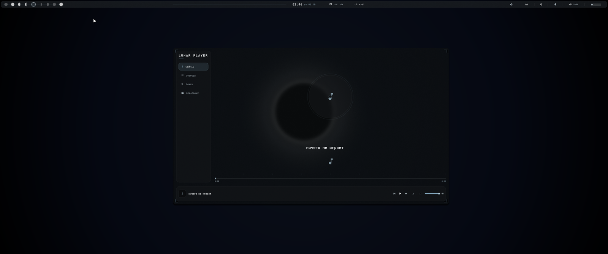

</div>

В баре плеер живёт «рельсой»: в покое — тонкая линия, при воспроизведении — название, прогресс и cava; клик открывает полное окно или медиа-карточку.

<div align="center">

## Обзор столов

</div>

**`SUPER + O`** (или `SUPER + SHIFT + TAB`) — `LunarOverview.qml`: все девять столов сеткой с живыми миниатюрами окон (`ScreencopyView`), окна перетаскиваются между столами мышью.

<div align="center">

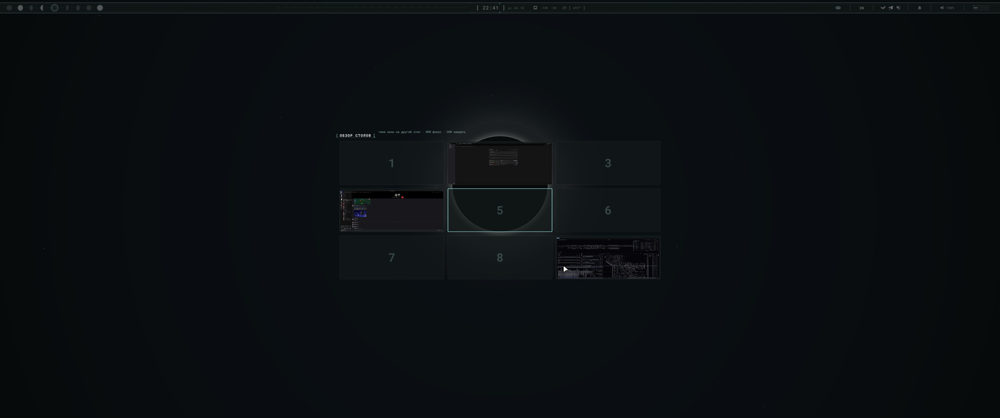

</div>

<div align="center">

## Агент OpenCode

</div>

**`SUPER + A`** — оверлей-агент `LunarAgent.qml` поверх рабочего стола, работает под профилем OpenCode `lunar` (свой промпт и память в `.config/opencode/agent/lunar.md`). Перед отправкой подмешивается справка: память агента и контекст системы (активное окно, стол, сеть, звук, GPU, медиа). У окна есть тумблер контекста (`ctx`) и разбор результата.

Агент **сам действия не выполняет**: он предлагает блок `lunar-action`, оверлей показывает карточку и выполняет его только по кнопке — без шелла (argv) и лишь по белому списку `hyprctl` / `qs ipc call` / скриптов `eclipse-*.sh`. Это единственная граница между агентом и системой (`/etc/sudoers.d/lunar-agent`, `eclipse-launch.sh`).

<div align="center">

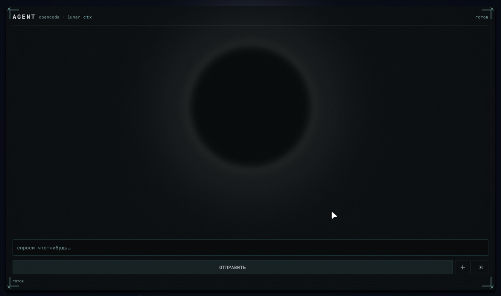

</div>

<div align="center">

## Календарь

</div>

Локальный, без сети: клик по дню в правом сайдбаре → список событий и форма (название, время, за сколько минут напомнить). Точки на днях показывают, где есть события; напоминание приходит уведомлением mako, звук — опцией. События — в `~/.local/share/lunar/calendar.json`, логика — `hypr/scripts/eclipse-calendar.py`.

<div align="center">


</div>

<div align="center">

## Запись экрана

</div>

**`SUPER + SHIFT + R`** — `eclipse-record.sh` пишет экран через `wf-recorder` в `~/Videos/lunar-*.mp4`; аппаратный кодек (VAAPI/NVENC) с откатом на софт. Список записей и тумблер — в правом сайдбаре, качество и монитор — **Hub → Devices**. Настройки — в `~/.config/lunar/record.json`.

<div align="center">

## Обновления

</div>

**Hub → Update** — состояние (буфер, число пакетов), кнопки **ОБНОВИТЬ** / **ОБНОВИТЬ СРАЗУ** / **ОТКАТ** / **ПРОВЕРИТЬ** / **ПОЧИСТИТЬ**, новости Arch с переводом на русский.

`eclipse-update.sh` — буфер 1–2 дня, `informant`, бэкап, `pacman -Syu` (+ AUR), затем гигиена: `paccache -rk2` и журнал ≤ 200 МБ. `eclipse-backup.sh` — ротация 5 бэкапов; **timeshift** — снимки перед обновлением, откат — кнопкой **ОТКАТ**.

<div align="center">

## Буфер обмена

</div>

**`SUPER + V`** — история `cliphist` окном `LunarClipboard.qml`: текст и картинки, клик — скопировать, ПКМ — удалить. Наблюдатели `wl-paste` поднимаются на старте сессии.

<div align="center">

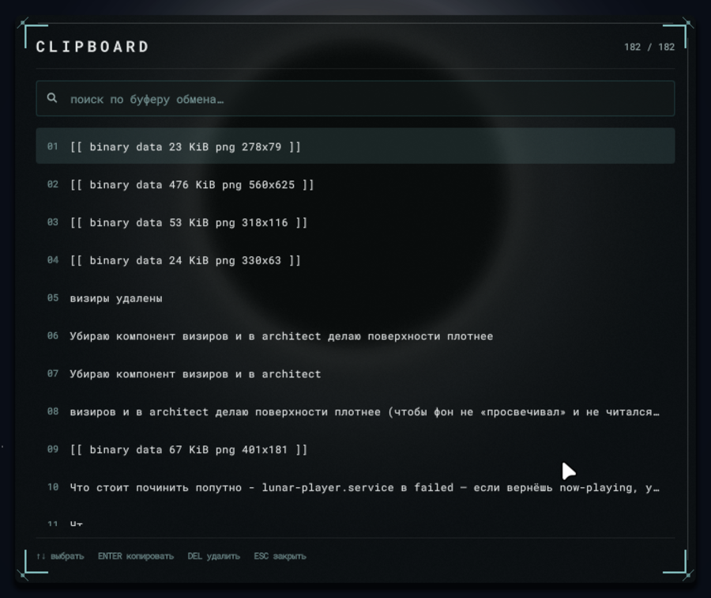

</div>

<div align="center">

## Питание

</div>

**`SUPER + ESC`** — меню `LunarPower.qml`: спящий режим, гибернация, выход, перезагрузка, выключение.

<div align="center">

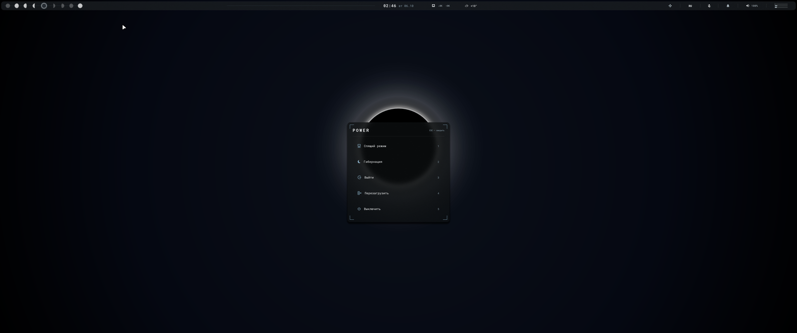

</div>

<div align="center">

## Шпаргалка

</div>

**`SUPER + /`** — сжимаемая GTK-шпаргалка по всем хоткеям (`eclipse-cheatsheet.py`).

<div align="center">

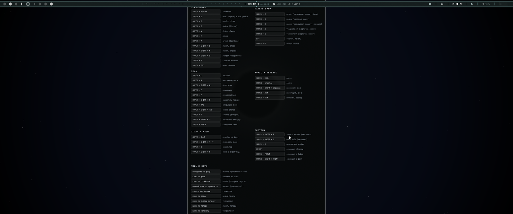

</div>

<div align="center">

## Установка

</div>

Нужен **Hyprland 0.55+** (конфиг на Lua) и Arch-подобная система.

```bash
git clone https://github.com/AlanMillerSora/lunar-hyprland.git ~/rice
cd ~/rice
./install.sh             # база: зависимости + конфиги + палитра
./install.sh --sddm      # + тема экрана входа (SDDM)
./install.sh --plymouth  # + заставка при загрузке (меняет загрузку)
./install.sh --zapret    # + обход DPI (Discord/YouTube)
```

| Флаг | Что делает |
|---|---|
| `--no-deps` | только конфиги, без пакетов |
| `--deps-only` | только зависимости |
| `--status` | состояние SDDM / Plymouth / zapret |
| `--disable-sddm` | вернуть штатную тему входа |
| `--disable-plymouth` | выключить заставку |
| `--plymouth-rescue` | пункт меню «без заставки» (UKI) |

Системные темы и сервисы — **SDDM**, **Plymouth**, **zapret** — ставятся только по явному флагу; без них установщик трогает лишь `~/.config` и системные мелочи. Зависимости ставит `get-deps.sh` (pacman + AUR через `yay`/`paru`; если их нет — поставит `yay-bin`). После установки — перелогин в Hyprland (или `hyprctl reload`).

Повторный запуск безопасен: прежние конфиги складываются в `~/.config-backup-<дата>/` (последние 5), аватар переносится, палитра перегенерируется. Установщик также ставит user-юниты (`lunar-homepage`, `lunar-player`, `lunar-tgproxy`), системный `lunar-cpu-performance` (CPU всегда `performance`), настраивает Wi-Fi (**iwd** для ассоциации + **systemd-networkd** для IP; `EnableNetworkConfiguration=false`, powersave для `ath12k*` выключен), root-хелперы в `/usr/local/lib/lunar/` и узкий sudoers `/etc/sudoers.d/lunar-agent`.

<div align="center">

## Загрузка

</div>

Заставку рисует своя тема Plymouth `lunar`: кольцо-корона, диск Луны и надпись **LUNAR ECLIPSE** с полосой прогресса. Включается хуком `plymouth`, `quiet splash` в `/etc/kernel/cmdline` и пересборкой UKI. В меню GRUB есть пункт **«Lunar Eclipse (без заставки)»**.

```bash
./install.sh --plymouth               # включить (хук + cmdline + пересборка)
sudo ./install.sh --status            # состояние
sudo ./install.sh --disable-plymouth  # выключить и вернуть загрузку
sudo ./install.sh --plymouth-rescue   # (UKI) пункт меню «без заставки»
```

Тема — `plymouth/lunar/`. На UKI-машине установщик гасит лишний пункт `10_linux` (он создаёт пункт без initramfs); после обновления пакета `grub` права могут сброситься — тогда прогнать `./install.sh --plymouth` заново.

<div align="center">

## Экран входа

</div>

Тема входа — `lunar` (`sddm/lunar/`, Roboto Mono, палитра риса): крупный аватар врезается в карточку, **WELCOME <имя>**, строка пароля с подчёркиванием, индикатор раскладки (клик — переключить) и **CAPS LOCK**, часы, русская дата, кнопка **ВОЙТИ →**, выбор сессии и питание.

<div align="center">


</div>

```bash
./install.sh --sddm               # поставить и включить тему lunar
sudo ./install.sh --status        # состояние
sudo ./install.sh --disable-sddm  # вернуть штатную тему
```

Предпросмотр без риска: `sddm-greeter --test-mode --theme /usr/share/sddm/themes/lunar`.

**Единый аватар.** Один на всё: `~/.config/avatars/avatar.png` — Hub → Interface → Аватар и экран входа. Смена — в **Hub → Interface → Аватар** (выбор и обрезка) или скриптом:

```bash
~/.config/hypr/scripts/eclipse-avatar.sh pick                   # выбрать файл
~/.config/hypr/scripts/eclipse-avatar.sh apply <cs> <cx> <cy>   # обрезать и скруглить
~/.config/hypr/scripts/eclipse-avatar.sh /путь/картинка.png     # поставить готовый файл
```

Синхронизация с темой SDDM идёт через узкое NOPASSWD-правило `/etc/sudoers.d/lunar-agent` (root-хелпер `avatar-sync.sh`).

<div align="center">

## Zapret и Vencord

</div>

**Zapret — обход DPI.** Оригинальный [zapret](https://github.com/bol-van/zapret) в `/opt/zapret` (+ `zapret.service`), чтобы открывались Discord и YouTube. Списки хостов — `zapret/zapret-hosts-user.txt`, drop-in `wait-online-any.conf` не даёт сервису ждать неактивный Wi-Fi. Управление — **Hub → Network → Zapret**.

```bash
~/.config/hypr/scripts/eclipse-zapret.sh status   # состояние
~/.config/hypr/scripts/eclipse-zapret.sh toggle   # вкл/выкл (+ автозапуск)
~/.config/hypr/scripts/eclipse-zapret.sh update   # обновить и пересобрать
~/.config/hypr/scripts/eclipse-zapret.sh tune     # подобрать стратегию (blockcheck)
```

**Zapret-TG — прокси Telegram.** Локальный MTProto-прокси [tg-ws-proxy](https://github.com/Flowseal/tg-ws-proxy) (AUR `tg-ws-proxy-cli`), слушает `127.0.0.1:1443`, живёт как user-юнит `lunar-tgproxy`. Управление — **Hub → Network → Zapret-TG** (кнопка **ОТКРЫТЬ В TG** открывает `tg://proxy`).

```bash
~/.config/hypr/scripts/eclipse-zapret-tg.sh status   # состояние
~/.config/hypr/scripts/eclipse-zapret-tg.sh toggle   # вкл/выкл
~/.config/hypr/scripts/eclipse-zapret-tg.sh link     # tg://proxy-ссылка
```

Секрет — в `~/.config/lunar/tgproxy.env` (в репозиторий не попадает).

**Vencord — мод Discord.** Вшит в официальный клиент. После обновления Discord — **ПЕРЕПАТЧИТЬ** в **Hub → Network → Vencord**.

```bash
~/.config/hypr/scripts/eclipse-vencord.sh status   # состояние
~/.config/hypr/scripts/eclipse-vencord.sh patch    # закрыть Discord, пропатчить, запустить
~/.config/hypr/scripts/eclipse-vencord.sh update   # обновить инсталлятор и пропатчить
```

<div align="center">

## Игры (Game Mode)

</div>

`SUPER + SHIFT + G` — анимации и blur выкл, DND, пауза hypridle, tearing. Откладываются обновление, бэкап и пересборка zapret; сервисы из `gamemode-pause.conf` выгружаются и возвращаются при выходе. Игры запускаются через **Steam и Lutris** (Proton/GE-Proton).

<div align="center">

## NVIDIA

</div>

Переменные включаются, только если карта найдена — один конфиг для NVIDIA и AMD/Intel. Открытый модуль — **`nvidia-open`** (на стоковом ядре `linux`; `nvidia-open-dkms` — для нештатных ядер), user-space — `nvidia-utils`. Turing и новее — `nvidia-open*`; Pascal и старше — legacy `nvidia-580xx-dkms` (AUR).

<details>
<summary>Пакеты, KMS и гибридная графика</summary>

```
nvidia-open  (или nvidia-open-dkms)  <ядро>-headers  nvidia-utils  nvidia-settings  libva-nvidia-driver  libva-utils
lib32-nvidia-utils
```

`libva-nvidia-driver` — VAAPI поверх NVENC (аппаратная запись экрана), проверка: `vainfo | grep -i Encoder`. `lib32-nvidia-utils` — те же библиотеки для 32-битных игр Steam/Proton.

**KMS.** С `nvidia-utils` 615 DRM включён по умолчанию (`modeset`/`fbdev` = `Y`), иначе нужен `nvidia_drm.modeset=1`. Нужен драйвер **555+** (для Blackwell/RTX 50xx — 570+).

**Гибридная графика** автоматически не настраивается: если вывод идёт через iGPU, переменные NVIDIA не включаются. Для принудительного вывода — `AQ_DRM_DEVICES` (Hyprland Wiki → Nvidia).

Уже учтено: `GBM_BACKEND=nvidia-drm`, графики GPU через `nvidia-smi`, ночной свет `gammastep`.

</details>

<div align="center">

## Приложения

</div>

Палитра и монохром разложены по всем приложениям:

| Приложение | Что настроено |
|---|---|
| **kitty** | Roboto Mono 16, прозрачность 0.78, зерно тайлом `noise.png`, Nerd-глифы через JetBrainsMono, powerline-таббар, `include lunar-theme.conf` |
| **btop** | тема `lunar` из палитры, truecolor, температуры CPU/GPU |
| **yazi** | монохром, иконки выключены (`▸`), открытие `code --wait`, превью шрифтов |
| **Firefox** | тёмный монохром, вертикальные вкладки, без рекламы/телеметрии, своя новая вкладка (`lunar/home/firefox-home.html`) |
| **GTK 3/4** | theme `Adwaita-dark`, иконки `Tela-dark`, курсор Bibata, `@import lunar-colors.css` |
| **qt6ct** | Fusion + `custom_palette`, своя схема (для меню трея Quickshell) |
| **mako** | Roboto Mono, цвет из `include=colors.conf` |
| **fastfetch / bat** | монохром (`logo.color`, `ansi`) |

| kitty | yazi |
|:---:|:---:|
| 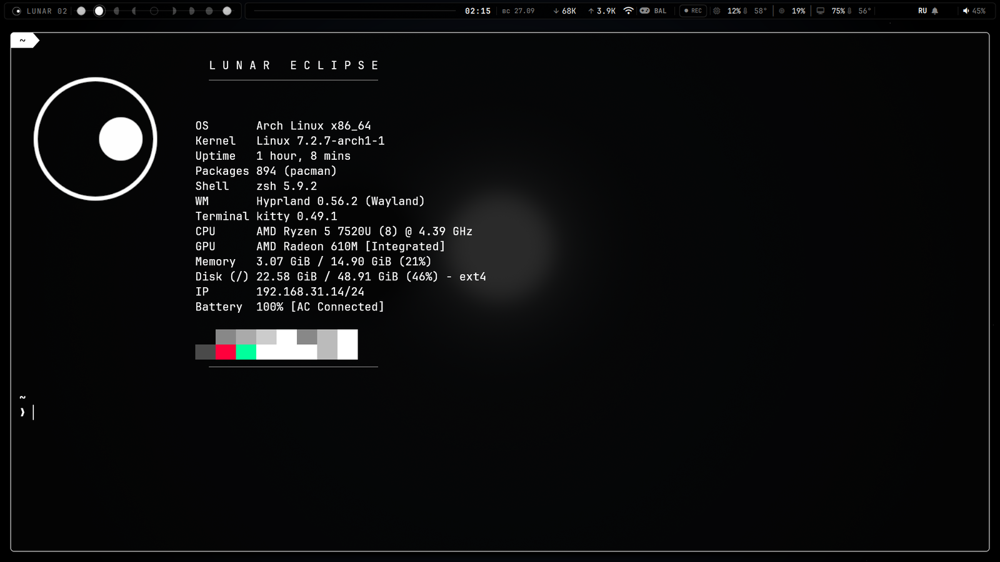 | 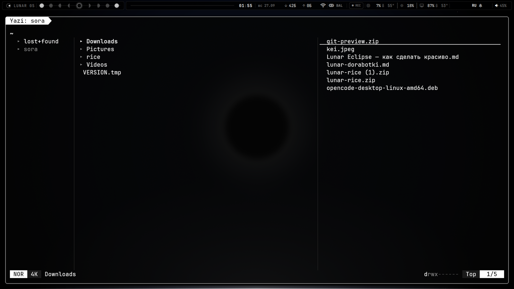 |

| btop | Firefox (своя новая вкладка) |
|:---:|:---:|
| 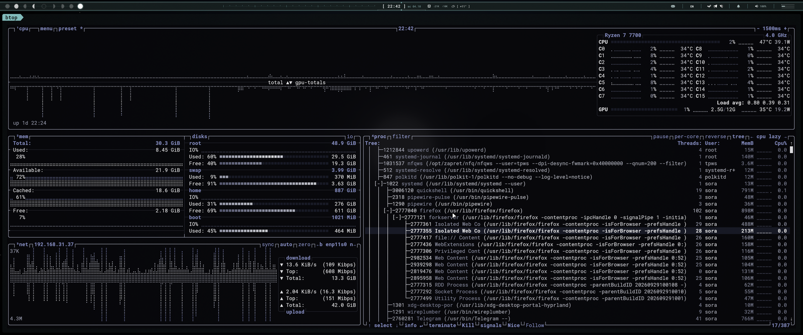 | 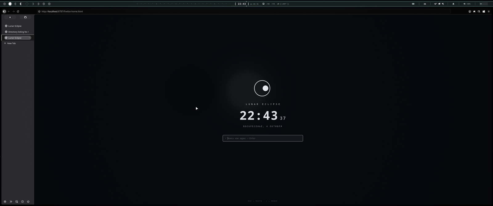 |

<div align="center">

## Компоненты

</div>

| Компонент | Файл | Что делает |
|---|---|---|
| **Обои** | `quickshell/LunarWallpaper.qml`, `LunarWallpaperScene.qml` | Сцена затмения или картинка (Qt Quick): фаза по столу 1–9, звёзды, метеоры, пыль. Превью — `preview.qml` |
| **Панель** | `quickshell/LunarPanel.qml`, `BarState.qml` | Одна плашка по содержимому (34px): марка + фазы, центр — медиа-линия/часы, справа — сеть, погода, Game Mode, PERF, систем-остров, трей, уведомления, звук. Состав ячеек — `bar.json` |
| **Панели режимов** | `quickshell/panels/Panel*.qml` | Тела режимов: пульт (звук), медиа, поиск, уведомления, телеметрия, погода |
| **Hub** | `quickshell/LunarHub.qml` | Лаунчер + настройки (1320×820, ресайзится): Launch, System, Devices, Network, Interface, Games, Dev, Update, Media |
| **Sidebar** | `quickshell/LunarSidebar.qml` | Слева: api-limit (лимиты OpenCode Go), заметки |
| **Sidebar R** | `quickshell/LunarSidebarRight.qml` | Справа: календарь, запись экрана |
| **Плеер** | `quickshell/LunarPlayer.qml`, `PlayerCore.qml`, `Player*.qml` | mpv-IPC: очередь, поиск (yt-dlp), локальная музыка, винил, cava |
| **Агент** | `quickshell/LunarAgent.qml`, `.config/opencode/agent/lunar.md` | Оверлей OpenCode с белым списком действий |
| **Обзор** | `quickshell/LunarOverview.qml` | Девять столов с живыми миниатюрами, drag-and-drop окон |
| **Буфер / питание / трей / OSD** | `LunarClipboard.qml`, `LunarPower.qml`, `LunarTray.qml`, `LunarOsd.qml` | cliphist, меню питания, трей, всплывающий OSD |
| **polkit** | `quickshell/LunarPolkit.qml` | Свой агент polkit (вместо polkit-kde) |
| **Палитра** | `.config/lunar/palette.toml`, `hypr/scripts/eclipse-palette.py` | Один источник цвета → шелл, kitty, GTK3/4, qt6ct, mako, btop, yazi, fastfetch + KDE-схема |
| **Тема** | `quickshell/Theme.qml` | Токены ритма и палитра; движение `anim`; настройки интерфейса (`lunar-ui.json`) |
| **Общий слой** | `quickshell/widgets/shared/` | Единые компоненты: `Card`, `SectionHeader`, `ActionTile`, `MetricRow`, `Toggle`, `MiniBar`, `Cell`, `HoverBg`, `Anim` |
| **Скрипты** | `hypr/scripts/eclipse-*.{sh,py}` | Палитра, обновление, бэкап, запись, Game Mode, очистка, статус, аватар, запуск, календарь, шпаргалка, лимиты, Zapret, Vencord |
| **Юниты** | `systemd/` | `lunar-quickshell`, `lunar-player`, `lunar-homepage`, `lunar-tgproxy`, `lunar-cpu-performance` |

<div align="center">

## Горячие клавиши

</div>

| Клавиши | Действие |
|---|---|
| `SUPER + RETURN` | Терминал (kitty) |
| `SUPER + G` | Hub: лаунчер + настройки |
| `SUPER + E` | Файлы (Thunar) |
| `SUPER + V` | Буфер обмена (cliphist) |
| `SUPER + B` | Подбор обоев: сцена по фазам / картинки с диска |
| `SUPER + M` | Плеер (Lunar Player / mpv) |
| `SUPER + A` | Агент OpenCode |
| `SUPER + O` / `SHIFT+TAB` | Обзор столов |
| `SUPER + C` / `X` / `D` / `N` / `I` | Панель бара: пульт / медиа / поиск / уведомления / телеметрия |
| `SUPER + SHIFT + E` | Боковая панель (слева) |
| `SUPER + SHIFT + N` | Панель справа (календарь/запись) |
| `SUPER + SHIFT + R` | Запись экрана (вкл/выкл) |
| `SUPER + SHIFT + G` | Game Mode (вкл/выкл) |
| `SUPER + SHIFT + D` | Hub: раздел «Разработка» |
| `SUPER + /` | Шпаргалка по хоткеям |
| `SUPER + Q` | Закрыть окно |
| `SUPER + W` / `SHIFT+W` | Развернуть / полный экран |
| `SUPER + F` / `P` / `SPACE` | Плавающее / псевдо / следующее окно |
| `SUPER + SHIFT + P` | Закрепить окно поверх |
| `SUPER + TAB` / `SHIFT+TAB` | Следующее окно / обзор столов |
| `SUPER + ←↑↓→` / `HJKL` | Фокус |
| `SUPER + SHIFT + ←↑↓→` | Перенос окна |
| `SUPER + 1…9` | Рабочий стол (фаза затмения) |
| `SUPER + SHIFT + 1…9` | Перенести окно на стол |
| `SUPER + T` / `SHIFT+T` | Группа / закрепить активное |
| `SUPER + S` / `SHIFT+S` | Scratchpad (в него / переместить окно) |
| `SUPER + ESC` | Меню питания |
| `PRINT` / `SUPER + PRINT` | Скриншот: область / весь экран (в буфер) |
| `SUPER + SHIFT + PRINT` | Скриншот всего экрана в файл |
| `SUPER + R` | Перезагрузить Hyprland |
| `XF86Audio*` | Громкость, mute, mic-mute, play/next/prev |

Раскладка — `us,ru` (переключение `Alt + Shift`). Сжимаемая шпаргалка по всем хоткеям — `SUPER + /`.

<div align="center">

## Структура репозитория

</div>

```
~/rice/
├── .config/
│   ├── hypr/{hyprland.lua, hypridle.conf, scripts/}
│   │   └── scripts/eclipse-*.sh · eclipse-*.py
│   ├── quickshell/                 ← вся оболочка (панель, Hub, сайдбары, плеер, агент…)
│   │   ├── shell.qml, Lunar*.qml, Theme.qml, BarState.qml
│   │   ├── panels/, Player*.qml, SettingsPages/, widgets/shared/
│   ├── lunar/{palette.toml, templates/*.in, home/, lunar.bash, gamemode-pause.conf}
│   ├── avatars/avatar.png          ← единый аватар (рис + экран входа)
│   ├── kitty/ btop/ yazi/ firefox/ gtk-3.0/ gtk-4.0/ qt6ct/ mako/ fastfetch/ bat/ Code/ opencode/ fontconfig/
│   └── kdeglobals, starship.toml, .zshrc
├── systemd/  color-schemes/  plymouth/lunar/  sddm/lunar/  zapret/  assets/{logo.svg, screens/}
├── install.sh  get-deps.sh  ui.sh  release.sh
└── README.md  AGENTS.md  LICENSE  VERSION
```

<div align="center">

## Если что-то сломалось

</div>

```bash
systemctl --user restart lunar-quickshell.service        # перезапуск
systemctl --user status  lunar-quickshell.service        # что случилось
systemctl --user reset-failed lunar-quickshell.service   # если «start-limit-hit»
```

Юнит ловит серию падений (5 за 30 с) и по `OnFailure` пишет диагностику в `~/.cache/lunar/quickshell-failure.log` и в уведомление. Не помогло — запусти вручную: `quickshell`.

Откат: конфиги — `git -C ~/rice checkout -- .config`; система — снимком timeshift (Hub → Update → **ОТКАТ**).

<div align="center">

## Лицензия

</div>

[MIT](LICENSE)
